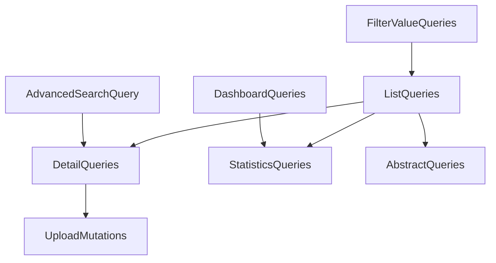

# API Inventory Documentation

## Overview

This document provides a comprehensive inventory of all GraphQL APIs available in the DOPAMS application. It serves as a complete reference guide listing every query and mutation, their parameters, return values, and where they are used throughout the frontend application. This inventory is essential for developers to understand what APIs are available, how to use them, and where they are currently being utilized in the application.

The DOPAMS application uses GraphQL exclusively for all backend communication. All APIs are accessed through a single endpoint at `/graphql`, with queries used for data retrieval and mutations used for data modifications. This centralized approach provides type safety, efficient data fetching, and a clear contract between frontend and backend.

---

## Table of Contents

1. [API Overview](#api-overview)
2. [Query APIs](#query-apis)
   - [Home & Dashboard Queries](#home--dashboard-queries)
   - [FIR (First Information Report) Queries](#fir-first-information-report-queries)
   - [Accused & Arrest Queries](#accused--arrest-queries)
   - [Criminal Profile Queries](#criminal-profile-queries)
   - [Advanced Search Queries](#advanced-search-queries)
   - [Seizures Queries](#seizures-queries)
   - [User Management Queries](#user-management-queries)
   - [Criminal Network Queries](#criminal-network-queries)
3. [Mutation APIs](#mutation-apis)
   - [User Management Mutations](#user-management-mutations)
   - [File Upload Mutations](#file-upload-mutations)
4. [API Usage Mapping](#api-usage-mapping)
5. [Parameter Reference Guide](#parameter-reference-guide)
6. [Return Type Reference Guide](#return-type-reference-guide)
7. [Filter Type Reference Guide](#filter-type-reference-guide)
8. [Enum Values Reference](#enum-values-reference)

---

## API Overview

### API Statistics

The DOPAMS application currently provides:

- **Total Queries**: 30+ query operations
- **Total Mutations**: 10+ mutation operations
- **API Domains**: 8 major functional domains
- **Filter Types**: 3 primary filter input types
- **Common Types**: Multiple shared types and enums

### API Categorization

APIs are organized into the following functional domains:

```
┌─────────────────────────────────────────────────────────────┐
│                    API Domain Structure                      │
└─────────────────────────────────────────────────────────────┘

1. Home & Dashboard APIs
   ├─ Statistics and overview queries
   ├─ Classification queries
   └─ Regional analysis queries

2. FIR (First Information Report) APIs
   ├─ List and detail queries
   ├─ Statistics and abstract queries
   └─ Filter value queries

3. Accused & Arrest APIs
   ├─ List and detail queries
   ├─ Statistics and abstract queries
   └─ Filter value queries

4. Criminal Profile APIs
   ├─ Profile list and detail queries
   ├─ Case history queries
   └─ Person search queries

5. Advanced Search APIs
   ├─ Multi-vertical search query
   └─ Field autocomplete query

6. Seizures APIs
   ├─ Abstract and statistics queries
   └─ Filter value queries

7. User Management APIs
   ├─ User list and detail queries
   └─ User management mutations

8. Criminal Network APIs
   └─ Network visualization query

9. File Upload APIs
   ├─ FIR file upload mutation
   └─ Criminal profile file upload mutation
```

### API Dependency Relationships

Many APIs have dependencies on other APIs. For example, filter value queries depend on filter input types, and detail queries depend on list queries for navigation. Understanding these relationships helps developers understand the API ecosystem.

#### Diagram: dependency overview (conceptual)



```
API Dependency Flow:

Filter Value Queries
    │
    ▼
List Queries (with filters)
    │
    ▼
Detail Queries (by ID)
    │
    ▼
Statistics/Abstract Queries (for analysis)
```

---

## Query APIs

### Home & Dashboard Queries

The Home and Dashboard APIs provide comprehensive statistics and analytics for the main dashboard view. These queries support date range filtering and return aggregated data suitable for visualization in charts, cards, and tables.

#### `overallCrimeStats`

**Operation Type**: Query  
**Purpose**: Provides high-level summary statistics for the entire system, giving administrators and officers a quick overview of crime statistics within a specified date range.

**Parameters**:
- `from` (String, optional): The start date for the statistics period in ISO format (YYYY-MM-DD). When omitted, statistics include all records from the beginning of available data.
- `to` (String, optional): The end date for the statistics period in ISO format (YYYY-MM-DD). When omitted, statistics include all records up to the current date.

**Return Value Structure**:
The query returns an object containing three key metrics:
- `totalSeizuresWorth`: A numeric value representing the total monetary value of all drug seizures within the specified date range. This value is calculated by summing the estimated or actual worth of all seized drugs.
- `totalFirs`: An integer count representing the total number of First Information Reports registered within the specified date range.
- `totalAccused`: An integer count representing the total number of accused persons involved in cases within the specified date range.

**Frontend Usage Locations**:
- **Primary Usage**: `routes/home/main/Overview.tsx` - This component displays the overall crime statistics as prominent cards on the main dashboard. The statistics are shown as large, visually distinct cards that provide immediate insight into system-wide metrics.

**Use Cases**:
- Dashboard overview cards showing key metrics
- Executive summary reports
- Quick system health checks
- Performance monitoring

**Related APIs**:
- Works in conjunction with other dashboard queries to provide comprehensive overview
- Often used alongside `regionalOverview` for comparative analysis

---

#### `caseStatusClassification`

**Operation Type**: Query  
**Purpose**: Returns statistical breakdown of cases grouped by their current status. This helps officers understand the distribution of cases across different stages of the legal process.

**Parameters**:
- `from` (String, optional): Start date for filtering cases
- `to` (String, optional): End date for filtering cases

**Return Value Structure**:
Returns an array of classification objects, where each object contains:
- `label`: A string representing the case status name (e.g., "Under Investigation", "Chargesheeted", "Pending Trial", "Disposed", "Acquittal", "Conviction")
- `value`: A numeric count representing how many cases fall into this status category

**Frontend Usage Locations**:
- **Primary Usage**: `routes/home/main/CaseStatus.tsx` - This component renders a pie chart or bar chart showing the distribution of cases by status. The visualization helps users quickly understand the proportion of cases in each status category.

**Use Cases**:
- Case status distribution visualization
- Workload analysis by case status
- Identifying bottlenecks in case processing
- Performance metrics for case management

**Status Categories**:
The query typically returns classifications for statuses such as Under Investigation, Chargesheeted, Pending Trial, Disposed, Acquittal, and Conviction. The exact statuses depend on the data in the system.

---

#### `regionalOverview`

**Operation Type**: Query  
**Purpose**: Provides crime statistics broken down by geographical units (police stations, districts, or administrative units). This enables regional analysis and helps identify areas with higher crime rates or specific patterns.

**Parameters**:
- `from` (String, optional): Start date for the analysis period
- `to` (String, optional): End date for the analysis period

**Return Value Structure**:
Returns an array of regional data objects, where each object represents a geographical unit and contains:
- `unit`: The name or identifier of the administrative unit
- `totalFirs`: Total number of FIRs registered in this unit
- `totalAccused`: Total number of accused persons in this unit
- Additional regional-specific metrics as available

**Frontend Usage Locations**:
- **Primary Usage**: `routes/home/main/RegionalOverview.tsx` - This component displays regional statistics in a grid layout, showing cards or tiles for each unit with their respective statistics. This allows users to compare performance across different regions.

**Use Cases**:
- Regional performance comparison
- Resource allocation planning
- Identifying high-crime areas
- Regional trend analysis

---

#### `drugData`

**Operation Type**: Query  
**Purpose**: Retrieves detailed drug-related data for specific drugs within a date range. This query supports multi-drug analysis, allowing users to compare data across different drug types.

**Parameters**:
- `from` (String, optional): Start date for the data period
- `to` (String, optional): End date for the data period
- `drugNames` (Array of String, required): A list of drug names for which to retrieve data. This parameter is required and must contain at least one drug name. Common drug names include substances like Heroin, Cocaine, Cannabis, Methamphetamine, etc.

**Return Value Structure**:
Returns an array of drug data objects, where each object represents one drug and contains:
- `label`: The name of the drug
- `value`: A numeric value representing quantity, count, or worth depending on the metric
- Additional drug-specific information such as quantity seized, number of cases, or monetary value

**Frontend Usage Locations**:
- **Primary Usage**: `routes/home/seizure-info/DrugData.tsx` - This component provides an interactive drug data visualization. Users can select multiple drugs from a dropdown, and the component displays comparative data for the selected drugs, typically in a chart format such as a bar chart or line chart.

**Use Cases**:
- Multi-drug comparison analysis
- Drug trend visualization
- Identifying most prevalent drugs
- Drug-specific case analysis

**Integration Notes**:
This query is often used in conjunction with `seizuresFilterValues` query, which provides the list of available drug names for the dropdown selection.

---

#### `drugCases`

**Operation Type**: Query  
**Purpose**: Returns drug case statistics grouped by drug type. This provides a high-level overview of how cases are distributed across different drug categories.

**Parameters**:
- `from` (String, optional): Start date for filtering cases
- `to` (String, optional): End date for filtering cases

**Return Value Structure**:
Returns an array of drug case objects, where each object contains:
- Drug type identifier or name
- Case count or other relevant statistics for that drug type

**Frontend Usage Locations**:
- **Primary Usage**: `routes/home/seizure-info/DrugTypes.tsx` - This component displays a chart showing the distribution of cases by drug type, helping users understand which drugs are most commonly involved in cases.

**Use Cases**:
- Drug type distribution analysis
- Identifying most common drug types in cases
- Drug category trend analysis

---

#### `caseClassificationUI`

**Operation Type**: Query  
**Purpose**: Provides case classification statistics formatted specifically for UI display. This query returns data optimized for visualization components.

**Parameters**:
- `from` (String, optional): Start date for the classification period
- `to` (String, optional): End date for the classification period

**Return Value Structure**:
Returns an array of classification objects with `label` and `value` properties, formatted for direct use in UI components.

**Frontend Usage Locations**:
- **Primary Usage**: `routes/home/fir-info/CaseClassificationUI.tsx` - This component renders a chart showing case classifications, helping users understand how cases are categorized.

**Use Cases**:
- Case classification visualization
- Category-based analysis
- Classification trend monitoring

---

#### `trialCasesClassification`

**Operation Type**: Query  
**Purpose**: Returns classification statistics specifically for cases that are in trial or have completed trial proceedings. This focuses on the trial phase of the legal process.

**Parameters**:
- `from` (String, optional): Start date for filtering trial cases
- `to` (String, optional): End date for filtering trial cases

**Return Value Structure**:
Returns an array of classification objects representing different trial case categories or statuses.

**Frontend Usage Locations**:
- **Primary Usage**: `routes/home/fir-info/TrailCasesClassification.tsx` - This component displays trial case classifications in a chart format, showing the distribution of cases in various trial stages or outcomes.

**Use Cases**:
- Trial case analysis
- Court performance monitoring
- Trial outcome tracking

---

#### `accusedTypeClassification`

**Operation Type**: Query  
**Purpose**: Provides statistics on accused persons grouped by their type or role in cases. This helps understand the distribution of main accused versus co-accused, or other accused type categorizations.

**Parameters**:
- `from` (String, optional): Start date for filtering accused records
- `to` (String, optional): End date for filtering accused records

**Return Value Structure**:
Returns an array of classification objects where each object represents an accused type category with its count.

**Frontend Usage Locations**:
- **Primary Usage**: `routes/home/accused-info/AccusedCategory.tsx` - This component displays a chart showing the distribution of accused persons by type, such as Main Accused, Co-Accused, etc.

**Use Cases**:
- Accused type distribution analysis
- Understanding accused role patterns
- Category-based accused analysis

---

#### `domicileClassification`

**Operation Type**: Query  
**Purpose**: Returns statistics on accused persons grouped by their domicile classification. This helps understand the geographical origin or residence patterns of accused persons.

**Parameters**:
- `from` (String, optional): Start date for filtering records
- `to` (String, optional): End date for filtering records

**Return Value Structure**:
Returns an array of classification objects representing different domicile categories (e.g., Within State, Outside State, Foreign Nationals).

**Frontend Usage Locations**:
- **Primary Usage**: `routes/home/accused-info/DomicileClassification.tsx` - This component displays a chart showing the distribution of accused persons by domicile, helping identify patterns in accused origins.

**Use Cases**:
- Domicile pattern analysis
- Geographical origin tracking
- Migration pattern identification

---

#### `stipulatedTimeClassification`

**Operation Type**: Query  
**Purpose**: Provides classification of cases based on stipulated time periods for chargesheet filing or other legal deadlines. This helps monitor compliance with legal timeframes.

**Parameters**:
- `from` (String, optional): Start date for the analysis period
- `to` (String, optional): End date for the analysis period

**Return Value Structure**:
Returns an array of classification objects representing different time period categories (e.g., Within Stipulated Time, Beyond Stipulated Time).

**Frontend Usage Locations**:
- **Primary Usage**: `routes/home/fir-info/UICasesTimeline.tsx` - This component displays a timeline or chart showing cases classified by their compliance with stipulated time periods, helping monitor legal deadline adherence.

**Use Cases**:
- Legal deadline compliance monitoring
- Time-based case analysis
- Performance tracking against stipulated periods

---

#### `investigationRelatedInfo`

**Operation Type**: Query  
**Purpose**: Retrieves comprehensive investigation-related information and statistics. This includes data about investigation status, chargesheet filing, and related investigation metrics.

**Parameters**:
- `from` (String, optional): Start date for filtering investigation data
- `to` (String, optional): End date for filtering investigation data

**Return Value Structure**:
Returns an investigation-related data object containing various investigation metrics, status information, and related statistics.

**Frontend Usage Locations**:
- **Primary Usage**: `routes/home/InvestigationRelated.tsx` - This component displays investigation-related information, providing insights into investigation progress and status.

**Use Cases**:
- Investigation progress tracking
- Investigation status monitoring
- Investigation performance analysis

---

#### `courtRelatedInfo`

**Operation Type**: Query  
**Purpose**: Returns court-related information and statistics, including data about court proceedings, trial status, and court outcomes.

**Parameters**:
- `from` (String, optional): Start date for filtering court data
- `to` (String, optional): End date for filtering court data

**Return Value Structure**:
Returns a court-related data object containing court proceedings information, trial statistics, and court outcome data.

**Frontend Usage Locations**:
- **Primary Usage**: `routes/home/CourtRelated.tsx` - This component displays court-related information, showing court proceedings status and outcomes.

**Use Cases**:
- Court proceedings tracking
- Trial status monitoring
- Court outcome analysis

---

### FIR (First Information Report) Queries

FIR queries provide comprehensive access to First Information Report data, supporting listing, detail viewing, filtering, and statistical analysis of FIR records.

#### `firs`

**Operation Type**: Query  
**Purpose**: Retrieves a paginated list of FIRs with comprehensive filtering, sorting, and pagination capabilities. This is the primary query for browsing and searching FIR records.

**Parameters**:
- `page` (Int, optional, default: 1): The page number for pagination. Pages are 1-indexed, meaning the first page is page 1.
- `limit` (Int, optional, default: 10): The number of records to return per page. Common values range from 10 to 100 records per page.
- `sortKey` (FirSortByEnumType, optional, default: 'crimeRegDate'): The field by which to sort the results. Available options include crime registration date, FIR number, unit, police station, and other FIR-related fields.
- `sortOrder` (SortTypeEnumType, optional, default: 'desc'): The sort direction, either ascending ('asc') or descending ('desc'). Default is descending order.
- `filters` (FirFilterInputType, optional): A complex filter object allowing multiple filter criteria to be applied simultaneously. When multiple filters are provided, they are combined using AND logic.

**FirFilterInputType Structure**:
The filter object supports the following filter fields:
- `firNumber` (String): Filter by exact or partial FIR number match
- `crimeType` (String): Filter by specific crime type
- `name` (String): Filter by accused name (searches in FIR records)
- `relativeName` (String): Filter by relative name of accused
- `dateRange` (StringRangeType): Filter by date range using an object with 'from' and 'to' date strings
- `domicile` (DomicileType): Filter by domicile using state and district
- `caseStatus` (Array of String): Filter by one or more case statuses (e.g., ["Under Investigation", "Chargesheeted"])
- `psName` (Array of String): Filter by one or more police station names
- `caseClass` (Array of String): Filter by one or more case classifications
- `units` (Array of String): Filter by one or more administrative units
- `accuseds` (Array of String): Filter by specific accused IDs
- `years` (Array of Int): Filter by one or more years
- `drugTypes` (Array of String): Filter by one or more drug types
- `drugQuantityRange` (IntRangeType): Filter by drug quantity range using 'from' and 'to' integers
- `drugWorthRange` (IntRangeType): Filter by drug worth range using 'from' and 'to' integers

**Return Value Structure**:
Returns an object containing:
- `nodes`: An array of FIR objects, where each FIR object contains comprehensive information including ID, unit, police station, year, FIR number, section, crime registration date, brief facts, number of accused involved, accused details, drug information, case classification, case status, stipulated period for chargesheet, and associated documents.
- `pageInfo`: Pagination metadata object containing:
  - `isFirstPage`: Boolean indicating if this is the first page
  - `isLastPage`: Boolean indicating if this is the last page
  - `currentPage`: Integer representing the current page number
  - `previousPage`: Integer representing the previous page number (null if on first page)
  - `nextPage`: Integer representing the next page number (null if on last page)
  - `pageCount`: Integer representing total number of pages
  - `totalCount`: Integer representing total number of records matching the filter criteria

**Frontend Usage Locations**:
- **Primary Usage**: `routes/case-status/firs/index.tsx` - The main FIRs listing page uses this query to display all FIRs in a paginated, filterable, and sortable table. Users can apply filters, change sorting, and navigate through pages.
- **Secondary Usage**: `routes/search-tool/individuals/FIRBasedSearch.tsx` - The FIR-based search tool uses this query with name-based filtering to search for FIRs by accused name.
- **Secondary Usage**: `routes/search-tool/individuals/DrugBasedSearch.tsx` - The drug-based search tool uses this query with drug type filtering to find FIRs related to specific drugs.

**Use Cases**:
- Browsing all FIRs with pagination
- Filtering FIRs by multiple criteria
- Searching FIRs by name or other attributes
- Sorting FIRs by various fields
- Exporting filtered FIR lists

**Performance Considerations**:
- Large result sets are paginated to improve performance
- Filters are applied server-side to reduce data transfer
- Sorting is performed on the database for efficiency

---

#### `fir`

**Operation Type**: Query  
**Purpose**: Retrieves comprehensive detailed information for a specific FIR by its unique identifier. This query returns all related data including accused details, property information, chargesheets, and documents.

**Parameters**:
- `id` (ID!, required): The unique identifier of the FIR. This is a required parameter and must be a valid FIR ID from the system.

**Return Value Structure**:
Returns a complete FIR object containing all available information:
- **Basic FIR Information**: Unit, police station, year, FIR number, FIR registration number, major head, minor head, section, crime registration date, FIR type, crime type, investigating officer name and rank, brief facts, number of accused involved
- **Accused Details**: Array of accused information including their IDs and associated values
- **Property Details**: Array of property objects containing property status, recovery information, place of recovery, date of seizure, nature of property, ownership information, estimated value, recovered value, property particulars, and category
- **MO Seizures Details**: Array of modus operandi and seizure details including sequence number, MO ID, type, subtype, description, seizure location and personnel, strength of evidence, place of seizure addresses, and descriptions
- **Chargesheet Details**: Information about filed chargesheets including dates and status
- **Disposal Details**: Information about case disposal including disposal date and outcome
- **Documents**: Array of document objects containing document names and links
- **Interrogation Reports**: Array of interrogation report objects with detailed interrogation information

**Frontend Usage Locations**:
- **Primary Usage**: `routes/case-status/firs/[id]/index.tsx` - The FIR detail page uses this query to display comprehensive information about a single FIR. The page typically uses a tabbed interface to organize different sections of FIR data (Overview, Property, Chargesheets, Documents, etc.).

**Use Cases**:
- Viewing complete FIR details
- Accessing related documents
- Reviewing accused information
- Checking property and seizure details
- Reviewing chargesheet and disposal information

**Data Relationships**:
This query aggregates data from multiple related entities, providing a complete view of a FIR and all its associations.

---

#### `firStatistics`

**Operation Type**: Query  
**Purpose**: Returns statistical summary and aggregations for FIRs based on provided filter criteria. This query is optimized for generating summary statistics rather than returning individual records.

**Parameters**:
- `filters` (FirFilterInputType, optional): Filter criteria to apply before calculating statistics. Uses the same filter structure as the `firs` query. When filters are provided, statistics are calculated only for FIRs matching the criteria.

**Return Value Structure**:
Returns a statistics object containing various aggregated metrics such as:
- Total count of FIRs matching filters
- Counts by various categories (status, type, etc.)
- Aggregated values (sums, averages, etc.)
- Other statistical measures relevant to FIR analysis

**Frontend Usage Locations**:
- **Primary Usage**: `routes/crime-stats/firs/FirsStats.tsx` - This component displays summary statistics cards showing key metrics for FIRs, often filtered by user-selected criteria.

**Use Cases**:
- Dashboard statistics display
- Filtered statistics analysis
- Performance metrics calculation
- Summary report generation

---

#### `firsAbstract`

**Operation Type**: Query  
**Purpose**: Retrieves abstract or summary data for FIRs, structured in a hierarchical format suitable for charts and visualizations. This query returns data organized by units, police stations, and years.

**Parameters**:
- `filters` (FirFilterInputType, optional): Filter criteria to apply. Uses the same filter structure as other FIR queries.

**Return Value Structure**:
Returns an abstract data object containing:
- `years`: Array of years for which data is available
- `units`: Array of unit objects, where each unit contains:
  - Unit identification and name
  - `children`: Array of police station objects within the unit
  - `totalsByYear`: Array of year-wise totals with metrics like under investigation count, pending trial count, disposed count, acquittal count, conviction count, chargesheeted count, and various quantity classifications
  - `grandTotals`: Aggregated totals across all years with the same metric structure

Each police station object within a unit also contains `totalsByYear` and `grandTotals` with similar structure.

**Frontend Usage Locations**:
- **Primary Usage**: `routes/crime-stats/firs/FirsAbstract.tsx` - This component displays hierarchical FIR statistics in an expandable table format, allowing users to drill down from units to police stations to year-wise data.
- **Secondary Usage**: `routes/crime-stats/firs/GenerateGraph.tsx` - This component uses the abstract data to generate charts and graphs visualizing FIR statistics.

**Use Cases**:
- Hierarchical statistical analysis
- Unit and station performance comparison
- Year-over-year trend analysis
- Chart and graph generation
- Expandable statistical tables

**Data Structure Benefits**:
The hierarchical structure allows for drill-down analysis from high-level units to specific police stations and time periods, making it ideal for interactive visualizations.

---

#### `firFilterValues`

**Operation Type**: Query  
**Purpose**: Returns available filter values for FIR filters, optionally filtered by current filter criteria. This query is essential for populating filter dropdowns with valid options.

**Parameters**:
- `filters` (FirFilterInputType, optional): Current filter criteria. When provided, the query returns only filter values that are valid given the current filter selections. This enables dependent filtering where selecting one filter narrows down options for other filters.

**Return Value Structure**:
Returns an object containing arrays of available values for various filter fields:
- `caseClass`: Array of available case class values
- `caseStatus`: Array of available case status values
- `ps`: Array of available police station names
- `units`: Array of available unit names
- `years`: Array of available years
- `drugTypes`: Array of available drug type names
- Additional filter value arrays as applicable

**Frontend Usage Locations**:
- **Primary Usage**: `routes/case-status/firs/filters.tsx` - The FIR filters component uses this query to populate all filter dropdowns with available options. When users select certain filters, the query is re-executed with those filters to update dependent dropdown options.
- **Secondary Usage**: `routes/case-status/cases/filters.tsx` - The cases filters component uses this query for case-related filtering.
- **Secondary Usage**: `routes/crime-stats/firs/filters.tsx` - The crime statistics FIR filters component uses this query for statistical filtering.

**Use Cases**:
- Populating filter dropdowns
- Implementing dependent filters
- Validating filter selections
- Providing filter suggestions

**Dependent Filtering**:
When filters are provided, the query returns only values that make sense given the current selections. For example, if a user selects a specific unit, the police station dropdown will only show stations within that unit.

---

### Accused & Arrest Queries

Accused queries provide access to information about arrested persons and accused individuals, supporting comprehensive profile management and analysis.

#### `accuseds`

**Operation Type**: Query  
**Purpose**: Retrieves a paginated list of accused persons with extensive filtering, sorting, and pagination support. This is the primary query for browsing and searching accused records.

**Parameters**:
- `page` (Int, optional, default: 1): Page number for pagination (1-indexed)
- `limit` (Int, optional, default: 10): Number of records per page
- `sortKey` (AccusedSortByEnumType, optional, default: 'crimeRegDate'): Field to sort by, such as crime registration date, name, age, etc.
- `sortOrder` (SortTypeEnumType, optional, default: 'desc'): Sort direction (ascending or descending)
- `filters` (AccusedFilterInputType, optional): Complex filter object with multiple filter criteria

**AccusedFilterInputType Structure**:
The filter object supports extensive filtering options:
- `name` (String): Filter by accused name
- `units` (Array of String): Filter by administrative units
- `years` (Array of Int): Filter by years
- `accuseds` (Array of String): Filter by specific accused IDs
- `drugTypes` (Array of String): Filter by drug types involved
- `nationality` (Array of String): Filter by nationality (e.g., ["Indian", "Foreign"])
- `state` (Array of String): Filter by state of residence
- `domicileClass` (Array of String): Filter by domicile classification
- `gender` (Array of String): Filter by gender
- `domicile` (DomicileType): Filter by specific domicile (state and district)
- `caseStatus` (Array of String): Filter by case status
- `ageRange` (IntRangeType): Filter by age range using 'from' and 'to' integers
- `dateRange` (StringRangeType): Filter by date range
- `ps` (Array of String): Filter by police stations
- `caseClass` (Array of String): Filter by case classifications
- `accusedStatus` (Array of String): Filter by accused status (e.g., ["Arrested", "At Large"])
- `accusedType` (Array of String): Filter by accused type (e.g., ["Main Accused", "Co-Accused"])

**Return Value Structure**:
Returns an object containing:
- `nodes`: Array of accused objects with information including ID, unit, police station, year, crime ID, FIR number, section, crime registration date, brief facts, number of accused involved, person ID, full name, accused details, parentage, age, present address details (district, state, country), accused status, accused type, number of crimes, previously involved cases, drug information, case classification, and case status
- `pageInfo`: Pagination metadata with the same structure as FIR pagination

**Frontend Usage Locations**:
- **Primary Usage**: `routes/case-status/arrests/index.tsx` - The main arrests listing page uses this query to display all accused persons in a comprehensive table with filtering and sorting capabilities.
- **Secondary Usage**: `routes/search-tool/individuals/OffenderBasedSearch.tsx` - The offender-based search tool uses this query with name-based filtering to search for accused persons.

**Use Cases**:
- Browsing all arrested persons
- Filtering by multiple personal and case attributes
- Searching for specific accused individuals
- Analyzing accused demographics
- Exporting accused lists

---

#### `accused`

**Operation Type**: Query  
**Purpose**: Retrieves comprehensive detailed information for a specific accused person by their accused ID. This provides complete profile information including personal details, physical description, addresses, and case history.

**Parameters**:
- `accusedId` (String!, required): The unique identifier of the accused person. This is a required parameter.

**Return Value Structure**:
Returns a complete accused object containing:
- **Personal Information**: Full name, parentage, relative type, gender, date of birth, age, occupation, education qualification, caste, sub-caste, religion, nationality, designation, place of work
- **Physical Description**: Height, build, color, hair, eyes, face, nose, ears, teeth, beard, mustache, mole, leucoderma, and other identifying features
- **Address Details**: Present address (house number, street, ward, locality, area, district, state, country, residency type, pin code, jurisdiction PS) and permanent address with the same structure
- **Case Information**: Associated FIRs, case status, case classification, accused status, accused type, accused code, sequence number
- **Previous Involvement**: Array of previously involved cases with their details
- **Drug Information**: Associated drugs and quantities
- **Additional Details**: Number of crimes, CCL status, and other relevant information

**Frontend Usage Locations**:
- **Primary Usage**: `routes/case-status/arrests/[id]/index.tsx` - The accused profile detail page uses this query to display comprehensive information about an accused person, typically organized in sections or tabs.

**Use Cases**:
- Viewing complete accused profile
- Reviewing physical description
- Checking address information
- Reviewing case history
- Accessing previous involvement records

---

#### `accusedStatistics`

**Operation Type**: Query  
**Purpose**: Returns statistical summary for accused persons based on filter criteria. Provides aggregated metrics for analysis and reporting.

**Parameters**:
- `filters` (AccusedFilterInputType, optional): Filter criteria to apply before calculating statistics

**Return Value Structure**:
Returns a statistics object containing:
- `totalAccused`: Total count of accused persons matching the filters
- Additional aggregated statistics such as counts by category, demographic breakdowns, and other relevant metrics

**Frontend Usage Locations**:
- **Primary Usage**: `routes/crime-stats/arrests/AccusedStats.tsx` - Displays summary statistics cards for accused persons
- **Secondary Usage**: `routes/crime-stats/arrests/AccusedFilteredStats.tsx` - Displays filtered statistics when filters are applied

**Use Cases**:
- Accused statistics dashboard
- Filtered statistical analysis
- Demographic analysis
- Performance metrics

---

#### `accusedAbstract`

**Operation Type**: Query  
**Purpose**: Retrieves abstract or summary data for accused persons, structured for charts and visualizations. Similar to FIRs abstract but focused on accused data.

**Parameters**:
- `filters` (AccusedFilterInputType, optional): Filter criteria to apply

**Return Value Structure**:
Returns an abstract data object with hierarchical structure similar to FIRs abstract, containing years array and units array with accused-specific metrics and aggregations.

**Frontend Usage Locations**:
- **Primary Usage**: `routes/crime-stats/arrests/ArrestsAbstract.tsx` - Displays hierarchical accused statistics
- **Secondary Usage**: `routes/crime-stats/arrests/GenerateGraph.tsx` - Generates charts from abstract data

**Use Cases**:
- Hierarchical accused statistics
- Chart generation
- Trend analysis
- Comparative analysis

---

#### `accusedFilterValues`

**Operation Type**: Query  
**Purpose**: Returns available filter values for accused filters, optionally filtered by current filter criteria.

**Parameters**:
- `filters` (AccusedFilterInputType, optional): Current filter criteria for dependent filtering

**Return Value Structure**:
Returns an object containing arrays of available values for:
- `caseClass`: Available case class values
- `caseStatus`: Available case status values
- `accusedStatus`: Available accused status values
- `ps`: Available police station names
- `gender`: Available gender values
- `nationality`: Available nationality values
- `state`: Available state values
- `domicile`: Available domicile values
- `accusedType`: Available accused type values

**Frontend Usage Locations**:
- **Primary Usage**: `routes/case-status/arrests/filters.tsx` - Populates accused filter dropdowns
- **Secondary Usage**: `routes/crime-stats/arrests/filters.tsx` - Populates crime statistics accused filters

**Use Cases**:
- Filter dropdown population
- Dependent filtering
- Filter validation

---

### Criminal Profile Queries

Criminal profile queries provide access to deduplicated criminal profiles, enabling comprehensive case history tracking and person management.

#### `criminalProfiles`

**Operation Type**: Query  
**Purpose**: Retrieves a paginated list of criminal profiles. These profiles represent deduplicated person records, ensuring that each person appears once even if they have multiple case entries.

**Parameters**:
- `page` (Int, optional, default: 1): Page number for pagination
- `limit` (Int, optional, default: 10): Records per page
- `sortKey` (CriminalProfileSortByEnumType, optional, default: 'noOfCrimes'): Field to sort by, typically number of crimes
- `sortOrder` (SortTypeEnumType, optional, default: 'desc'): Sort direction
- `filters` (CriminalProfilesFilterInputType, optional): Filter criteria, currently supporting name-based filtering

**CriminalProfilesFilterInputType Structure**:
- `name` (String): Filter by person name (supports partial matching)

**Return Value Structure**:
Returns an object containing:
- `nodes`: Array of criminal profile objects with summary information including ID, alias, name, surname, full name, relation type, relative name, gender, date of birth, age, address information, contact details, associated crimes array, number of crimes, previously involved cases, and document information
- `pageInfo`: Standard pagination metadata

**Frontend Usage Locations**:
- **Primary Usage**: `routes/criminal-profile/index.tsx` - The criminal profiles listing page displays all profiles in a table format with sorting and filtering capabilities.

**Use Cases**:
- Browsing all criminal profiles
- Searching profiles by name
- Identifying repeat offenders
- Profile management

---

#### `criminalProfile`

**Operation Type**: Query  
**Purpose**: Retrieves comprehensive detailed information for a specific criminal profile by person ID. This provides complete profile information including all associated crimes and documents.

**Parameters**:
- `id` (String!, required): The unique person ID identifier

**Return Value Structure**:
Returns a complete criminal profile object containing:
- **Personal Information**: Alias, name, surname, full name, relation type, relative name, gender, date of birth, age, occupation, education, caste, sub-caste, religion, nationality, domicile, designation, place of work
- **Present Address**: Complete address details including house number, street, ward, locality, area, district, state, country, residency type, pin code, jurisdiction PS
- **Permanent Address**: Complete permanent address with same structure as present address
- **Contact Information**: Phone number, country code, email ID
- **Associated Crimes**: Array of crime objects with FIR details, dates, sections, status, and other crime information
- **Documents**: Array of document objects with names and links
- **Identity Documents**: Array of identity document objects with type, link, identity type, and identity number
- **Statistics**: Arrest count, associated drugs, number of crimes
- **Additional Information**: DOPAMS links, counselling status, and other profile metadata

**Frontend Usage Locations**:
- **Primary Usage**: `routes/criminal-profile/[id]/index.tsx` - The criminal profile detail page displays comprehensive profile information in a tabbed interface, including Overview, Crime History, Documents, and Interrogation Data tabs.

**Use Cases**:
- Viewing complete criminal profile
- Reviewing case history
- Accessing profile documents
- Analyzing criminal patterns
- Profile management

---

#### `accusedCaseHistory`

**Operation Type**: Query  
**Purpose**: Retrieves complete case history for an accused person, including deduplicated records across multiple person entries. This query uses advanced deduplication algorithms to show all cases for a person even when they appear with slight variations in different FIRs.

**Parameters**:
- `accusedId` (String!, required): The accused ID to get case history for

**Return Value Structure**:
Returns a case history object containing:
- **Deduplication Metadata**: Person fingerprint (unique identifier), matching strategy used, matching tier (confidence level), confidence level description, duplicate status indicator
- **Person Information**: Canonical person ID, full name, parent name, age, district, phone number
- **Statistics**: Total crimes count, total duplicate records count, arrays of all person IDs and accused IDs that were matched
- **Crime History**: Array of crime history records, each containing crime ID, accused ID, FIR number, FIR registration number, FIR date, case status, police station name, district name, accused code, accused type, accused status, matching strategy, confidence level, and matching tier

**Frontend Usage Locations**:
- **Current Status**: Available but not actively used in the UI. The frontend currently uses the `criminalProfile.crimes` array instead. See `docs/GRAPHQL_CASE_HISTORY_QUERIES.md` for detailed usage examples.

**Use Cases**:
- Complete case history with deduplication
- Identifying all cases for a person across duplicate records
- Confidence-based case matching
- Duplicate record analysis

**Note**: This API provides advanced deduplication capabilities that are not currently utilized in the main UI but are available for future enhancements.

---

#### `personCaseHistory`

**Operation Type**: Query  
**Purpose**: Alternative to `accusedCaseHistory`, retrieves case history by person ID instead of accused ID. Provides the same deduplication capabilities.

**Parameters**:
- `personId` (String!, required): The person ID to get case history for

**Return Value Structure**:
Same structure as `accusedCaseHistory`

**Frontend Usage Locations**:
- Currently available but not used in UI

---

#### `searchPersonsByName`

**Operation Type**: Query  
**Purpose**: Searches for persons by name with deduplication support. Useful for finding repeat offenders or persons with multiple records.

**Parameters**:
- `name` (String!, required): Name to search for, supports partial matching

**Return Value Structure**:
Returns an array of person search result objects containing:
- Person fingerprint
- Matching strategy
- Full name, parent name, age, district, phone
- Total crimes count
- Total duplicate records count

**Frontend Usage Locations**:
- Currently available but not used in UI

---

### Advanced Search Queries

Advanced search queries provide powerful multi-entity search capabilities with complex filtering and field selection.

#### `advancedSearch`

**Operation Type**: Query  
**Purpose**: Performs advanced multi-vertical search across FIRs, accused, and other entities with complex filter criteria. This is the most flexible search query in the system.

**Parameters**:
- `page` (Int, optional, default: 1): Page number for pagination
- `limit` (Int, optional, default: 10): Records per page
- `sortKey` (AdvancedSearchColumnEnumType, optional, default: 'firDate'): Field to sort by from available search columns
- `sortOrder` (SortTypeEnumType, optional, default: 'desc'): Sort direction
- `filters` (Array of AdvancedSearchFilterInputType, optional): Array of filter criteria objects, allowing multiple filters with logical connectors
- `select` (Array of AdvancedSearchColumnEnumType, optional): Fields to include in results. This allows users to customize which columns are returned, improving performance for large result sets.

**AdvancedSearchFilterInputType Structure**:
Each filter object in the filters array contains:
- `field` (AdvancedSearchColumnEnumType, required): The field to filter on (e.g., firNumber, name, age, etc.)
- `operator` (AdvancedSearchOperatorsEnumType, required): The comparison operator (equals, contains, greaterThan, lessThan, between, etc.)
- `connector` (AdvancedSearchConnectorsEnumType, optional): Logical connector (AND or OR) for combining with next filter
- `value` (String, required): The filter value
- `value2` (String, optional): Second value for range operators (between, etc.)

**Return Value Structure**:
Returns an object containing:
- `nodes`: Array of search result objects. The structure of each object depends on the `select` parameter, but can include fields from both FIR and accused entities, making it a unified search result.
- `pageInfo`: Standard pagination metadata

**Frontend Usage Locations**:
- **Primary Usage**: `routes/search-tool/multi-vertical/index.tsx` - The multi-vertical search tool uses this query to provide powerful search capabilities across multiple entity types. Users can build complex queries with multiple criteria and select which fields to display.

**Use Cases**:
- Cross-entity searching
- Complex multi-criteria searches
- Customizable result columns
- Advanced filtering scenarios

**Search Capabilities**:
This query supports searching across FIRs, accused persons, and related entities simultaneously, with operators like equals, contains, greater than, less than, and between, combined with AND/OR logic.

---

#### `fieldAutoComplete`

**Operation Type**: Query  
**Purpose**: Provides autocomplete suggestions for specific fields in advanced search. This helps users discover valid values and improves search accuracy.

**Parameters**:
- `input` (String!, required): The user's input string to search for suggestions
- `fields` (Array of AdvancedSearchColumnEnumType!, required): Array of fields to search within for autocomplete suggestions

**Return Value Structure**:
Returns an array of autocomplete result objects, each containing:
- `field`: The field name that matched
- `value`: The suggested value

**Frontend Usage Locations**:
- **Primary Usage**: `routes/search-tool/fields.tsx` - The field autocomplete component uses this query to provide suggestions as users type in search fields, improving user experience and search accuracy.

**Use Cases**:
- Search field autocomplete
- Value discovery
- Input validation
- Search assistance

---

### Seizures Queries

Seizures queries provide access to drug seizure data and statistics, supporting analysis and reporting of seizure information.

#### `seizuresAbstract`

**Operation Type**: Query  
**Purpose**: Retrieves abstract or summary data for seizures, structured for charts and visualizations. Similar structure to FIRs abstract but focused on seizure metrics.

**Parameters**:
- `filters` (FirFilterInputType, optional): Filter criteria using the same filter structure as FIR queries

**Return Value Structure**:
Returns an abstract data object with hierarchical structure containing years, units, and police stations with seizure-specific metrics and aggregations.

**Frontend Usage Locations**:
- **Primary Usage**: `routes/crime-stats/seizures/SeizuresAbstract.tsx` - Displays hierarchical seizure statistics
- **Secondary Usage**: `routes/crime-stats/seizures/GenerateGraph.tsx` - Generates charts from seizure abstract data

**Use Cases**:
- Seizure statistics visualization
- Hierarchical seizure analysis
- Chart generation
- Trend analysis

---

#### `seizureStatistics`

**Operation Type**: Query  
**Purpose**: Returns statistical summary for seizures based on filter criteria.

**Parameters**:
- `filters` (FirFilterInputType, optional): Filter criteria

**Return Value Structure**:
Returns a statistics object with seizure-related counts and aggregations.

**Frontend Usage Locations**:
- **Primary Usage**: `routes/crime-stats/seizures/SeizuresStats.tsx` - Displays seizure statistics cards

**Use Cases**:
- Seizure statistics dashboard
- Filtered seizure analysis
- Performance metrics

---

#### `seizuresFilterValues`

**Operation Type**: Query  
**Purpose**: Returns available filter values for seizure filters.

**Parameters**:
- `filters` (FirFilterInputType, optional): Current filter criteria

**Return Value Structure**:
Returns an object containing arrays of available values for drug types, years, police stations, units, and other seizure-related filter fields.

**Frontend Usage Locations**:
- **Primary Usage**: `routes/crime-stats/seizures/filters.tsx` - Populates seizure filter dropdowns
- **Secondary Usage**: `routes/home/seizure-info/DrugData.tsx` - Provides drug options for the drug data dropdown

**Use Cases**:
- Filter dropdown population
- Drug type selection
- Dependent filtering

---

### User Management Queries

User management queries provide access to system user information and support user administration functionality.

#### `users`

**Operation Type**: Query  
**Purpose**: Retrieves a paginated list of system users with sorting support. Used for user administration and management.

**Parameters**:
- `page` (Int, optional, default: 1): Page number
- `limit` (Int, optional, default: 10): Records per page
- `sortKey` (UserSortByEnumType, optional, default: 'createdAt'): Field to sort by (e.g., email, createdAt, role)
- `sortOrder` (SortTypeEnumType, optional, default: 'desc'): Sort direction
- `filters` (UserFilterInputType, optional): Filter criteria for users

**Return Value Structure**:
Returns an object containing:
- `nodes`: Array of user objects with ID, email, status, role, creation date, and update date
- `pageInfo`: Standard pagination metadata

**Frontend Usage Locations**:
- **Primary Usage**: `routes/users/index.tsx` - The users listing page displays all system users in a table with sorting capabilities.

**Use Cases**:
- User administration
- User list management
- User search and filtering

---

#### `user`

**Operation Type**: Query  
**Purpose**: Retrieves detailed information for a specific user by ID.

**Parameters**:
- `id` (ID!, required): User ID

**Return Value Structure**:
Returns a user object containing:
- `id`: Unique user identifier
- `email`: User email address
- `status`: User account status (active/inactive)
- `role`: User role (admin/user)
- `backgroundColor`: User's UI theme preference color
- `createdAt`: Account creation timestamp
- `updatedAt`: Last update timestamp

**Frontend Usage Locations**:
- **Primary Usage**: `routes/users/[Id]/index.tsx` - User detail page displays user information and provides management options
- **Secondary Usage**: `routes/users/Profile.tsx` - User profile component displays current user's profile information

**Use Cases**:
- Viewing user details
- User profile management
- User administration

---

### Criminal Network Queries

Criminal network queries provide access to relationship data for network visualization and analysis.

#### `criminalNetworkDetails`

**Operation Type**: Query  
**Purpose**: Retrieves criminal network visualization data showing relationships between persons and crimes. This enables network graph visualization to identify criminal associations.

**Parameters**:
- `personId` (String!, required): Person ID to get network details for

**Return Value Structure**:
Returns a network person object containing:
- Person information (ID, full name, name, gender, age, relation type, relative name)
- Associated crimes array, where each crime contains:
  - Crime details (ID, FIR number, FIR registration number, police station, date, sections, crime type)
  - Related persons array, where each related person contains:
    - Person information
    - Their associated crimes
    - Further nested relationships (persons connected to those crimes)

This nested structure allows for multi-level network visualization showing how persons are connected through shared crimes.

**Frontend Usage Locations**:
- **Primary Usage**: `routes/criminal-network/[personId]/index.tsx` - The criminal network visualization page uses this query to render an interactive network graph showing person-crime relationships and criminal associations.

**Use Cases**:
- Criminal network visualization
- Identifying criminal associations
- Network analysis
- Relationship mapping

---

## Mutation APIs

Mutations are used to modify data in the system. Unlike queries, mutations are not automatically executed and must be explicitly called, typically in response to user actions.

### User Management Mutations

#### `login`

**Operation Type**: Mutation  
**Purpose**: Authenticates a user and establishes a session by returning a JWT authentication token.

**Parameters**:
- `email` (String!, required): User's email address used for authentication
- `password` (String!, required): User's password (sent securely over HTTPS)

**Return Value Structure**:
Returns an object containing:
- `token`: JWT authentication token that must be included in subsequent requests for authenticated operations
- `user`: User object with basic information including ID, email, status, role, backgroundColor, and timestamps

**Frontend Usage Locations**:
- **Primary Usage**: `routes/login/index.tsx` - The login page uses this mutation when users submit their credentials. On success, the token is stored and the user is redirected to the dashboard.

**Use Cases**:
- User authentication
- Session establishment
- Access control

**Security Notes**:
- Password is never stored or logged
- Token has expiration time
- Failed login attempts may be rate-limited

---

#### `createUser`

**Operation Type**: Mutation  
**Purpose**: Creates a new user account in the system. This is an admin-only operation.

**Parameters**:
- `email` (String!, required): Email address for the new user (must be unique)
- `password` (String!, required): Initial password for the new user
- `role` (UserRoleEnumType, required): User role to assign (e.g., ADMIN, USER)

**Return Value Structure**:
Returns the created user object with ID, email, role, status, and timestamps.

**Frontend Usage Locations**:
- **Primary Usage**: `routes/users/CreateUserDialogButton.tsx` - The create user dialog uses this mutation when administrators create new user accounts.

**Use Cases**:
- User account creation
- User administration
- Onboarding new users

**Permissions**:
- Admin role required
- Email must be unique

---

#### `updateUserRole`

**Operation Type**: Mutation  
**Purpose**: Updates the role of an existing user, changing their permissions and access level.

**Parameters**:
- `id` (ID!, required): User ID to update
- `role` (UserRoleEnumType, required): New role to assign

**Return Value Structure**:
Returns the updated user object with the new role.

**Frontend Usage Locations**:
- **Primary Usage**: `routes/users/[Id]/UpdateUserRole.tsx` - The update user role component uses this mutation to change a user's role.

**Use Cases**:
- Role management
- Permission updates
- User administration

---

#### `updateUserStatus`

**Operation Type**: Mutation  
**Purpose**: Updates the account status of a user, activating or deactivating their account.

**Parameters**:
- `id` (ID!, required): User ID to update
- `status` (UserStatusEnumType, required): New status (ACTIVE or INACTIVE)

**Return Value Structure**:
Returns the updated user object with the new status.

**Frontend Usage Locations**:
- **Primary Usage**: `routes/users/[Id]/UpdateUserStatus.tsx` - The update user status component uses this mutation to activate or deactivate user accounts.

**Use Cases**:
- Account activation/deactivation
- User management
- Access control

---

#### `updateUserBackgroundColor`

**Operation Type**: Mutation  
**Purpose**: Updates the background color preference for a user's UI theme. This is a user preference setting.

**Parameters**:
- `id` (ID!, required): User ID
- `backgroundColor` (String!, required): Hex color code (e.g., "#FFFFFF")

**Return Value Structure**:
Returns the updated user object with the new backgroundColor preference.

**Frontend Usage Locations**:
- **Primary Usage**: `components/ThemeCustomizer.tsx` - The theme customizer component uses this mutation when users change their UI background color preference.

**Use Cases**:
- UI customization
- User preferences
- Theme management

---

### File Upload Mutations

#### `uploadFirFile`

**Operation Type**: Mutation  
**Purpose**: Uploads a file or document associated with a specific FIR. Supports various file types including PDFs, images, and documents.

**Parameters**:
- `file` (Upload!, required): The file to upload, using GraphQL multipart request specification
- `firId` (ID!, required): FIR ID to associate the file with

**Return Value Structure**:
Returns a file upload confirmation string indicating success.

**Frontend Usage Locations**:
- **Primary Usage**: `routes/case-status/firs/[id]/UploadFilesDialog.tsx` - The FIR file upload dialog uses this mutation when users upload documents to a FIR.

**Use Cases**:
- Document attachment to FIRs
- Evidence file uploads
- Case documentation

**File Handling**:
- Files are stored securely on the server
- File size limits may apply
- Supported file types depend on backend configuration

---

#### `uploadCriminalProfileFile`

**Operation Type**: Mutation  
**Purpose**: Uploads a file or document associated with a criminal profile.

**Parameters**:
- `file` (Upload!, required): The file to upload
- `id` (ID!, required): Criminal profile ID to associate the file with

**Return Value Structure**:
Returns a file upload confirmation string.

**Frontend Usage Locations**:
- **Primary Usage**: `routes/criminal-profile/[id]/UploadFileDialog.tsx` - The criminal profile file upload dialog uses this mutation when users upload documents to a profile.

**Use Cases**:
- Profile document attachment
- Identity document uploads
- Profile documentation

---

## API Usage Mapping

This section provides a comprehensive mapping of which APIs are used in which frontend pages and components.

### Home/Dashboard Module API Usage

The Home/Dashboard module uses multiple APIs to populate various dashboard components:

```
Home Dashboard Page (routes/home/index.tsx)
│
├─→ Overview Component
│   └─→ overallCrimeStats API
│
├─→ Regional Overview Component
│   └─→ regionalOverview API
│
├─→ Case Status Component
│   └─→ caseStatusClassification API
│
├─→ Drug Data Component
│   ├─→ drugData API (main query)
│   └─→ seizuresFilterValues API (for drug options)
│
├─→ Drug Types Component
│   └─→ drugCases API
│
├─→ Case Classification Component
│   └─→ caseClassificationUI API
│
├─→ Trial Cases Component
│   └─→ trialCasesClassification API
│
├─→ Accused Category Component
│   └─→ accusedTypeClassification API
│
├─→ Domicile Classification Component
│   └─→ domicileClassification API
│
└─→ UI Cases Timeline Component
    └─→ stipulatedTimeClassification API
```

### Case Status - FIRs Module API Usage

```
FIRs Module
│
├─→ FIRs Listing Page (routes/case-status/firs/index.tsx)
│   ├─→ firs API (main data query)
│   └─→ firFilterValues API (for filter dropdowns)
│
├─→ FIR Detail Page (routes/case-status/firs/[id]/index.tsx)
│   ├─→ fir API (detail query)
│   └─→ uploadFirFile API (file upload mutation)
│
└─→ FIR Filters Component (routes/case-status/firs/filters.tsx)
    └─→ firFilterValues API
```

### Case Status - Arrests Module API Usage

```
Arrests Module
│
├─→ Arrests Listing Page (routes/case-status/arrests/index.tsx)
│   ├─→ accuseds API (main data query)
│   └─→ accusedFilterValues API (for filter dropdowns)
│
├─→ Accused Profile Detail (routes/case-status/arrests/[id]/index.tsx)
│   └─→ accused API (detail query)
│
└─→ Arrests Filters Component (routes/case-status/arrests/filters.tsx)
    └─→ accusedFilterValues API
```

### Criminal Profile Module API Usage

```
Criminal Profile Module
│
├─→ Profiles Listing (routes/criminal-profile/index.tsx)
│   └─→ criminalProfiles API
│
└─→ Profile Detail (routes/criminal-profile/[id]/index.tsx)
    ├─→ criminalProfile API (detail query)
    └─→ uploadCriminalProfileFile API (file upload mutation)
```

### Advanced Search Module API Usage

```
Advanced Search Module
│
├─→ Multi-Vertical Search (routes/search-tool/multi-vertical/index.tsx)
│   └─→ advancedSearch API
│
├─→ Field Autocomplete (routes/search-tool/fields.tsx)
│   └─→ fieldAutoComplete API
│
└─→ Individual Search Pages
    ├─→ FIR Based Search (routes/search-tool/individuals/FIRBasedSearch.tsx)
    │   └─→ firs API (with name filtering)
    ├─→ Drug Based Search (routes/search-tool/individuals/DrugBasedSearch.tsx)
    │   └─→ firs API (with drug filtering)
    └─→ Offender Based Search (routes/search-tool/individuals/OffenderBasedSearch.tsx)
        └─→ accuseds API (with name filtering)
```

### Crime Statistics Module API Usage

```
Crime Statistics Module
│
├─→ FIRs Statistics
│   ├─→ FirsAbstract Component (routes/crime-stats/firs/FirsAbstract.tsx)
│   │   └─→ firsAbstract API
│   ├─→ FirsStats Component (routes/crime-stats/firs/FirsStats.tsx)
│   │   └─→ firStatistics API
│   ├─→ GenerateGraph Component (routes/crime-stats/firs/GenerateGraph.tsx)
│   │   └─→ firsAbstract API
│   └─→ Filters Component (routes/crime-stats/firs/filters.tsx)
│       └─→ firFilterValues API
│
├─→ Arrests Statistics
│   ├─→ ArrestsAbstract Component (routes/crime-stats/arrests/ArrestsAbstract.tsx)
│   │   └─→ accusedAbstract API
│   ├─→ AccusedStats Component (routes/crime-stats/arrests/AccusedStats.tsx)
│   │   └─→ accusedStatistics API
│   ├─→ GenerateGraph Component (routes/crime-stats/arrests/GenerateGraph.tsx)
│   │   └─→ accusedAbstract API
│   └─→ Filters Component (routes/crime-stats/arrests/filters.tsx)
│       └─→ accusedFilterValues API
│
└─→ Seizures Statistics
    ├─→ SeizuresAbstract Component (routes/crime-stats/seizures/SeizuresAbstract.tsx)
    │   └─→ seizuresAbstract API
    ├─→ SeizuresStats Component (routes/crime-stats/seizures/SeizuresStats.tsx)
    │   └─→ seizureStatistics API
    ├─→ GenerateGraph Component (routes/crime-stats/seizures/GenerateGraph.tsx)
    │   └─→ seizuresAbstract API
    └─→ Filters Component (routes/crime-stats/seizures/filters.tsx)
        └─→ seizuresFilterValues API
```

### User Management Module API Usage

```
User Management Module
│
├─→ Users Listing (routes/users/index.tsx)
│   └─→ users API
│
├─→ User Detail (routes/users/[Id]/index.tsx)
│   ├─→ user API (detail query)
│   ├─→ updateUserRole API (mutation)
│   └─→ updateUserStatus API (mutation)
│
├─→ Create User (routes/users/CreateUserDialogButton.tsx)
│   └─→ createUser API (mutation)
│
└─→ User Profile (routes/users/Profile.tsx)
    └─→ user API
```

### Authentication Module API Usage

```
Authentication Module
│
└─→ Login Page (routes/login/index.tsx)
    └─→ login API (mutation)
```

### Criminal Network Module API Usage

```
Criminal Network Module
│
└─→ Network Visualization (routes/criminal-network/[personId]/index.tsx)
    └─→ criminalNetworkDetails API
```

### Theme Customization API Usage

```
Theme Customization
│
└─→ Theme Customizer Component (components/ThemeCustomizer.tsx)
    └─→ updateUserBackgroundColor API (mutation)
```

---

## Parameter Reference Guide

This section provides detailed reference information for all parameter types used across APIs.

### Date Parameters

Most dashboard and statistics queries accept date range parameters:

- **Format**: ISO 8601 date format (YYYY-MM-DD)
- **Type**: String
- **Optional**: Yes (when omitted, includes all available data)
- **Usage**: Used in `from` and `to` parameters for filtering data by date range

**Examples**:
- Start date: "2020-01-01"
- End date: "2024-12-31"
- Single date queries can use the same date for both from and to

### Pagination Parameters

List queries support pagination:

- **page** (Int): Page number, 1-indexed (first page is 1)
- **limit** (Int): Number of records per page
- **Default Values**: page defaults to 1, limit defaults to 10
- **Usage**: Controls which subset of records is returned

### Sorting Parameters

List queries support sorting:

- **sortKey**: Field name to sort by (varies by query type)
- **sortOrder**: Sort direction - "asc" for ascending, "desc" for descending
- **Default Values**: Typically defaults to date field in descending order
- **Usage**: Controls the order of returned records

### Filter Input Types

Three primary filter input types are used:

#### FirFilterInputType

Used for filtering FIR-related queries. Supports:
- String filters: firNumber, crimeType, name, relativeName
- Date range: dateRange (object with from and to strings)
- Domicile: domicile (object with state and district)
- Array filters: caseStatus, psName, caseClass, units, accuseds, years, drugTypes
- Range filters: drugQuantityRange, drugWorthRange (objects with from and to integers)

#### AccusedFilterInputType

Used for filtering accused-related queries. Supports:
- String filters: name
- Array filters: units, years, accuseds, drugTypes, nationality, state, domicileClass, gender, caseStatus, ps, caseClass, accusedStatus, accusedType
- Domicile: domicile (object with state and district)
- Range filters: ageRange (object with from and to integers), dateRange (object with from and to strings)

#### CriminalProfilesFilterInputType

Used for filtering criminal profiles. Currently supports:
- String filter: name

#### AdvancedSearchFilterInputType

Used in advanced search. Each filter object contains:
- field: The field to filter on
- operator: Comparison operator
- connector: Logical connector (AND/OR)
- value: Filter value
- value2: Second value for range operators

### ID Parameters

Many detail queries require ID parameters:

- **Type**: ID! (required)
- **Format**: String identifier
- **Usage**: Used to fetch specific records by their unique identifier
- **Examples**: FIR IDs, Accused IDs, Person IDs, User IDs

### Upload Parameters

File upload mutations use:

- **Type**: Upload! (required)
- **Format**: Multipart file upload
- **Usage**: Used for file uploads in uploadFirFile and uploadCriminalProfileFile mutations

---

## Return Type Reference Guide

This section describes the structure of return values for different API categories.

### Paginated List Returns

Most list queries return paginated results with this structure:

- **nodes**: Array of entity objects (FIRs, accused, users, etc.)
- **pageInfo**: Pagination metadata object containing:
  - isFirstPage: Boolean
  - isLastPage: Boolean
  - currentPage: Integer
  - previousPage: Integer or null
  - nextPage: Integer or null
  - pageCount: Integer
  - totalCount: Integer

### Classification Returns

Classification queries return arrays of objects with:

- **label**: String representing the category name
- **value**: Numeric count or value for that category

### Statistics Returns

Statistics queries return objects with:

- Aggregated counts
- Category breakdowns
- Summary metrics
- Structure varies by query type

### Abstract Returns

Abstract queries return hierarchical structures:

- **years**: Array of available years
- **units**: Array of unit objects with:
  - Unit identification
  - children: Array of child entities (e.g., police stations)
  - totalsByYear: Array of year-wise totals
  - grandTotals: Aggregated totals

### Detail Returns

Detail queries return complete entity objects with:

- All basic fields
- Related entity arrays
- Nested objects
- Complete information structure

---

## Filter Type Reference Guide

### FirFilterInputType

Complete structure and usage:

**String Filters**:
- `firNumber`: Filter by FIR number (exact or partial match)
- `crimeType`: Filter by crime type
- `name`: Filter by accused name in FIR
- `relativeName`: Filter by relative name

**Date Range Filter**:
- `dateRange`: Object with `from` (String) and `to` (String) date fields

**Domicile Filter**:
- `domicile`: Object with `state` (String) and `district` (String) fields

**Array Filters** (all accept arrays of strings or integers):
- `caseStatus`: Array of case status strings
- `psName`: Array of police station names
- `caseClass`: Array of case class strings
- `units`: Array of unit strings
- `accuseds`: Array of accused ID strings
- `years`: Array of year integers
- `drugTypes`: Array of drug type strings

**Range Filters**:
- `drugQuantityRange`: Object with `from` (Int) and `to` (Int) for quantity range
- `drugWorthRange`: Object with `from` (Int) and `to` (Int) for worth range

### AccusedFilterInputType

Complete structure:

**String Filters**:
- `name`: Filter by accused name

**Array Filters**:
- `units`, `years`, `accuseds`, `drugTypes`, `nationality`, `state`, `domicileClass`, `gender`, `caseStatus`, `ps`, `caseClass`, `accusedStatus`, `accusedType`: All accept arrays

**Range Filters**:
- `ageRange`: Object with `from` (Int) and `to` (Int) for age range
- `dateRange`: Object with `from` (String) and `to` (String) for date range

**Domicile Filter**:
- `domicile`: Object with `state` and `district` fields

### AdvancedSearchFilterInputType

Structure for advanced search filters:

- `field`: Field to filter on (from AdvancedSearchColumnEnumType)
- `operator`: Comparison operator (equals, contains, greaterThan, etc.)
- `connector`: Logical connector (AND, OR) for combining filters
- `value`: Primary filter value (required)
- `value2`: Secondary value for range operators (optional)

---

## Enum Values Reference

### SortTypeEnumType

Sort direction values:
- `asc`: Ascending order (A-Z, 1-9, oldest to newest)
- `desc`: Descending order (Z-A, 9-1, newest to oldest)

### UserRoleEnumType

User role values:
- `ADMIN`: Administrator role with full system access
- `USER`: Regular user role with standard access

### UserStatusEnumType

User account status values:
- `ACTIVE`: Active user account with full access
- `INACTIVE`: Inactive user account with restricted access

### DomicileType

Domicile object structure:
- `state`: String representing state name
- `district`: String representing district name

### StringRangeType

String range object structure:
- `from`: String representing start value
- `to`: String representing end value

### IntRangeType

Integer range object structure:
- `from`: Integer representing start value
- `to`: Integer representing end value

---

## API Usage Statistics

### Most Used APIs

Based on frontend usage analysis:

1. **firs** - Used in 3 different pages/components
2. **firFilterValues** - Used in 3 different filter components
3. **accuseds** - Used in 2 different pages/components
4. **accusedFilterValues** - Used in 2 different filter components
5. **criminalProfile** - Used in 1 detail page
6. **advancedSearch** - Used in 1 search tool
7. **firsAbstract** - Used in 2 statistics components
8. **accusedAbstract** - Used in 2 statistics components

### API Categories by Usage Frequency

- **High Frequency**: Filter value queries, list queries, detail queries
- **Medium Frequency**: Statistics queries, abstract queries
- **Low Frequency**: Case history queries (available but not actively used)

---

## API Relationships and Dependencies

### Query Dependencies

Some queries depend on others:

- Filter value queries depend on filter input types
- Detail queries depend on list queries for navigation
- Statistics queries may depend on list queries for context
- Abstract queries are independent but related to statistics queries

### Data Flow Dependencies

```
Filter Values Query
    ↓
List Query (with filters)
    ↓
Detail Query (by ID from list)
    ↓
Related Queries (statistics, abstract)
```

---

## API Versioning and Compatibility

### Current API Version

- **Version**: 1.0
- **Base Endpoint**: `/graphql`
- **Protocol**: GraphQL
- **Authentication**: JWT Token

### Backward Compatibility

- All APIs maintain backward compatibility
- New fields added to return types are optional
- New parameters are optional with defaults
- Breaking changes are avoided

---

## Additional Notes

### Date Format Standards

All date parameters should be in ISO format (YYYY-MM-DD) or as strings that can be parsed by standard date parsers.

### Pagination Best Practices

- Use appropriate page sizes (10-100 records typically)
- Implement proper pagination controls
- Handle edge cases (first page, last page)

### Filtering Best Practices

- Combine multiple filters for precise results
- Use filter value queries to populate dropdowns
- Implement dependent filtering for better UX

### Authentication Requirements

- Most queries require valid JWT token
- Only `login` and `signup` mutations are public
- Token expiration should be handled gracefully

### Error Handling

- All queries and mutations may return GraphQL errors
- Check error fields in responses
- Implement appropriate error handling in frontend

---

**Last Updated**: February 2026  
**Version**: 1.0  
**Document Status**: Complete API Inventory
