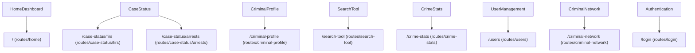

# Application Functionality Documentation

## Overview

This document provides comprehensive functionality-wise documentation for the DOPAMS application. It explains what the application does, how features are organized, what each page and component provides, and where code is located in the project structure. This documentation is essential for understanding the application's capabilities, user workflows, and code organization.

The DOPAMS (Drug Offenders Profiling, Analysis and Monitoring System) application is a comprehensive law enforcement management platform designed to streamline case management, criminal profiling, analytics, and reporting for drug-related offenses. The application is organized into distinct functional modules, each serving specific law enforcement needs.

---

## Table of Contents

1. [Application Overview](#application-overview)
2. [Core Functional Modules](#core-functional-modules)
3. [Feature Catalog](#feature-catalog)
4. [Page Functionality Guide](#page-functionality-guide)
5. [Component Organization](#component-organization)
6. [User Workflows and Journeys](#user-workflows-and-journeys)
7. [Feature Dependencies](#feature-dependencies)
8. [Directory Structure Guide](#directory-structure-guide)
9. [User Roles and Permissions](#user-roles-and-permissions)

---

## Application Overview

### Application Purpose

DOPAMS serves as a centralized digital platform for law enforcement agencies to manage, track, analyze, and report on drug-related criminal activities. The system replaces traditional paper-based and fragmented digital systems with a unified, intelligent platform that provides comprehensive case management, advanced analytics, and powerful search capabilities.

### Key Application Capabilities

The application provides six major functional capabilities:

**1. Case Management**
Complete lifecycle management of First Information Reports (FIRs) from registration through investigation, chargesheet filing, trial, and final disposal. The system tracks every stage of a case, maintains comprehensive documentation, and provides audit trails for accountability.

**2. Criminal Profiling**
Advanced person profiling with deduplication capabilities ensures that each accused person has a single, comprehensive profile even when they appear in multiple cases with slight variations in identifying information. Profiles include personal details, physical descriptions, addresses, contact information, and complete case history.

**3. Analytics and Reporting**
Comprehensive statistical analysis and visualization tools enable data-driven decision making. The system provides temporal analysis (trends over time), geographical analysis (crime distribution), demographic analysis (age, gender, nationality patterns), and case status analysis. Reports can be customized, filtered, and exported.

**4. Advanced Search**
Powerful multi-entity search capabilities allow users to search across FIRs, accused persons, and related entities simultaneously. Users can construct complex queries with multiple criteria, operators, and logical connectors, and customize which fields are displayed in results.

**5. Network Analysis**
Criminal network visualization helps identify relationships between persons and crimes, revealing patterns of criminal associations that may not be apparent in tabular data. This is particularly valuable for identifying organized crime networks and repeat offenders.

**6. Document Management**
Centralized document storage and management for cases and profiles. Officers can upload, organize, and access documents, photographs, and files associated with FIRs and criminal profiles, ensuring all case-related documentation is easily accessible.

### Application Benefits

The DOPAMS application delivers significant benefits to law enforcement operations:

- **Operational Efficiency**: Reduces time spent searching for information, generating reports, and tracking case progress through automated workflows and intelligent search
- **Data Quality**: Deduplication algorithms ensure accurate person records, reducing errors from duplicate or inconsistent data entry
- **Decision Support**: Advanced analytics enable data-driven decision making, helping identify trends, patterns, and areas requiring attention
- **Compliance**: Helps ensure compliance with reporting requirements and maintains comprehensive audit trails
- **Collaboration**: Enables multiple users to access and update information simultaneously, facilitating collaboration across units and departments
- **Centralization**: All drug-related case information in a single, searchable database eliminates the need to search through multiple physical files or disparate systems

---

## Core Functional Modules

The application is organized into eight core functional modules, each serving distinct purposes and user needs.

### Diagram: module to route map



### Module Organization Diagram

```
┌─────────────────────────────────────────────────────────────┐
│              DOPAMS Functional Modules                       │
└─────────────────────────────────────────────────────────────┘

1. Home/Dashboard Module
   ├─ Overview Statistics
   ├─ Regional Analysis
   ├─ Case Status Distribution
   └─ Drug Seizure Analytics

2. Case Status Module
   ├─ FIRs Management
   │   ├─ FIR Listing
   │   ├─ FIR Detail View
   │   └─ FIR Filters
   └─ Arrests Management
       ├─ Arrests Listing
       ├─ Accused Profile Detail
       └─ Arrest Filters

3. Criminal Profile Module
   ├─ Profile Listing
   ├─ Profile Detail View
   ├─ Case History
   └─ Document Management

4. Advanced Search Module
   ├─ Multi-Vertical Search
   ├─ Field Autocomplete
   └─ Individual Search Pages

5. Crime Statistics Module
   ├─ FIRs Statistics
   ├─ Arrests Statistics
   └─ Seizures Statistics

6. User Management Module
   ├─ User Listing
   ├─ User Detail Management
   └─ User Administration

7. Authentication Module
   └─ Login and Session Management

8. Criminal Network Module
   └─ Network Visualization
```

### Module 1: Home/Dashboard

**Purpose**: Provides a comprehensive overview of system-wide statistics and key metrics, giving administrators and officers immediate insight into crime patterns, trends, and system performance.

**Key Features**:
- Overall crime statistics display (total FIRs, accused, seizures worth)
- Regional overview showing crime distribution by geographical units
- Case status classification showing distribution of cases across different stages
- Drug-related analytics including drug data visualization and drug type distribution
- Various classification charts for cases, accused, and seizures
- Date range filtering for all dashboard components

**User Benefits**:
- Quick system health check
- Executive summary view
- Trend identification
- Performance monitoring

**Location in Codebase**: `dopams-narco/src/routes/home/`

### Module 2: Case Status

**Purpose**: Comprehensive case management functionality for FIRs and arrests, enabling officers to view, filter, search, and manage case information efficiently.

**Sub-modules**:

**2.1 FIRs Management**
- **Purpose**: Complete FIR lifecycle management
- **Features**: 
  - Paginated FIR listing with advanced filtering
  - Comprehensive FIR detail view with tabbed interface
  - File upload and document management
  - Export capabilities (PDF, Excel)
  - Search and filter functionality
- **Location**: `dopams-narco/src/routes/case-status/firs/`

**2.2 Arrests Management**
- **Purpose**: Management of arrested accused persons
- **Features**:
  - Paginated arrests listing with filtering
  - Detailed accused profile view
  - Previous involvement tracking
  - Demographic filtering
- **Location**: `dopams-narco/src/routes/case-status/arrests/`

**User Benefits**:
- Efficient case browsing and searching
- Complete case information access
- Document organization
- Case tracking and monitoring

### Module 3: Criminal Profile

**Purpose**: Deduplicated criminal profile management, ensuring each person has a single comprehensive profile with complete case history, even when they appear in multiple cases.

**Key Features**:
- Profile listing with search and filtering
- Comprehensive profile detail view with multiple tabs:
  - Overview: Personal information and summary
  - Crime History: All associated crimes
  - Documents: Attached files and documents
  - Interrogation Data: Interrogation reports
- Document upload and management
- PDF export functionality
- Case history tracking across duplicate records

**User Benefits**:
- Single source of truth for person information
- Complete case history visibility
- Document centralization
- Repeat offender identification

**Location in Codebase**: `dopams-narco/src/routes/criminal-profile/`

### Module 4: Advanced Search

**Purpose**: Powerful search capabilities across multiple entity types with complex query building and customizable result displays.

**Key Features**:
- Multi-vertical search across FIRs, accused, and related entities
- Dynamic filter builder with multiple criteria
- Field selection for customizable result columns
- Operator support (equals, contains, greater than, between, etc.)
- Logical connectors (AND/OR) for combining filters
- Field autocomplete for search assistance
- Individual search pages for specific entity types

**User Benefits**:
- Cross-entity searching
- Complex query construction
- Customizable results
- Improved search accuracy

**Location in Codebase**: `dopams-narco/src/routes/search-tool/`

### Module 5: Crime Statistics

**Purpose**: Comprehensive statistical analysis and visualization of crime data, enabling data-driven decision making and performance monitoring.

**Sub-modules**:

**5.1 FIRs Statistics**
- Hierarchical statistics by unit, station, and year
- Multiple metrics (under investigation, pending trial, disposed, etc.)
- Chart generation capabilities
- Filtered statistics

**5.2 Arrests Statistics**
- Accused statistics and aggregations
- Demographic breakdowns
- Trend analysis
- Chart visualization

**5.3 Seizures Statistics**
- Drug seizure statistics
- Quantity and worth analysis
- Drug type distribution
- Temporal trends

**User Benefits**:
- Data-driven insights
- Performance monitoring
- Trend identification
- Report generation

**Location in Codebase**: `dopams-narco/src/routes/crime-stats/`

### Module 6: User Management

**Purpose**: System user administration, allowing administrators to manage user accounts, roles, and permissions.

**Key Features**:
- User listing with sorting
- User detail view and management
- User creation (admin only)
- Role management
- Status management (activate/deactivate)
- User profile viewing

**User Benefits**:
- Centralized user administration
- Role-based access control
- Account management
- Security control

**Location in Codebase**: `dopams-narco/src/routes/users/`

### Module 7: Authentication

**Purpose**: User authentication and session management, ensuring secure access to the application.

**Key Features**:
- Login functionality
- Session establishment
- Token management
- Access control

**User Benefits**:
- Secure access
- Session management
- User identification

**Location in Codebase**: `dopams-narco/src/routes/login/`

### Module 8: Criminal Network

**Purpose**: Visualization of criminal networks showing relationships between persons and crimes, helping identify criminal associations and organized networks.

**Key Features**:
- Network graph visualization
- Person-crime relationship mapping
- Multi-level relationship exploration
- Interactive network navigation

**User Benefits**:
- Network identification
- Relationship discovery
- Pattern recognition
- Organized crime detection

**Location in Codebase**: `dopams-narco/src/routes/criminal-network/`

---

## Feature Catalog

This section provides detailed descriptions of all major features in the application, organized by functional area.

### Dashboard Features

#### Overall Statistics Feature

**Description**: Displays high-level summary statistics including total seizures worth, total FIRs registered, and total accused persons. These statistics are displayed as prominent cards on the main dashboard.

**User Workflow**:
1. User navigates to home/dashboard
2. System displays three key metric cards
3. User can adjust date range to see statistics for different periods
4. Statistics update automatically when date range changes

**Components Involved**:
- Main dashboard container (`routes/home/index.tsx`)
- Overview component (`routes/home/main/Overview.tsx`)

**Location**: `dopams-narco/src/routes/home/main/Overview.tsx`

#### Regional Overview Feature

**Description**: Provides crime statistics broken down by geographical units (police stations, districts, or administrative units). Enables regional comparison and performance analysis.

**User Workflow**:
1. User views dashboard
2. Regional overview section displays statistics by unit
3. User can see which units have higher crime rates
4. Date range filtering affects regional statistics

**Components Involved**:
- Regional overview component (`routes/home/main/RegionalOverview.tsx`)

**Location**: `dopams-narco/src/routes/home/main/RegionalOverview.tsx`

#### Case Status Classification Feature

**Description**: Visualizes the distribution of cases across different status categories (Under Investigation, Chargesheeted, Pending Trial, Disposed, etc.) using charts.

**User Workflow**:
1. User views dashboard
2. Case status chart displays case distribution
3. User can see proportion of cases in each status
4. Date range filtering updates the chart

**Components Involved**:
- Case status component (`routes/home/main/CaseStatus.tsx`)

**Location**: `dopams-narco/src/routes/home/main/CaseStatus.tsx`

#### Drug Data Visualization Feature

**Description**: Interactive drug data visualization allowing users to select multiple drugs and compare their data within a date range. Supports multi-drug selection and comparative analysis.

**User Workflow**:
1. User navigates to drug data section
2. User selects one or more drugs from dropdown
3. System displays comparative data for selected drugs
4. User can adjust date range
5. Chart updates to show selected drugs' data

**Components Involved**:
- Drug data component (`routes/home/seizure-info/DrugData.tsx`)

**Location**: `dopams-narco/src/routes/home/seizure-info/DrugData.tsx`

**Special Features**:
- Multi-drug selection
- Debounced search for drug selection
- Date range filtering
- Dynamic chart updates

### Case Management Features

#### FIRs Listing Feature

**Description**: Comprehensive FIR listing page with pagination, filtering, sorting, and search capabilities. Displays FIRs in a table format with extensive filter options.

**User Workflow**:
1. User navigates to Case Status → FIRs
2. System displays paginated list of FIRs
3. User can apply filters (date range, case status, police station, etc.)
4. User can sort by various fields
5. User can search by FIR number or accused name
6. User can navigate through pages
7. User can export filtered results

**Components Involved**:
- FIRs listing page (`routes/case-status/firs/index.tsx`)
- FIRs filters component (`routes/case-status/firs/filters.tsx`)
- FIRs export component (`routes/case-status/firs/FirsExport.tsx`)

**Location**: `dopams-narco/src/routes/case-status/firs/`

**Key Capabilities**:
- Server-side pagination
- Multi-criteria filtering
- Multi-column sorting
- Text search with debouncing
- Filter persistence (localStorage)
- Export to PDF/Excel

#### FIR Detail View Feature

**Description**: Comprehensive view of a single FIR with all related information organized in tabs. Includes accused details, property information, chargesheets, documents, and more.

**User Workflow**:
1. User clicks on a FIR from the listing
2. System navigates to FIR detail page
3. User views information in organized tabs:
   - Overview: Basic FIR information
   - Property: Property and seizure details
   - Chargesheets: Chargesheet information
   - Documents: Attached documents
   - Interrogation Reports: Interrogation data
4. User can upload new documents
5. User can export FIR to PDF

**Components Involved**:
- FIR detail page (`routes/case-status/firs/[id]/index.tsx`)
- Property details component (`routes/case-status/firs/[id]/PropertyDetails.tsx`)
- Chargesheets component (`routes/case-status/firs/[id]/ChargesheetsDetails.tsx`)
- Documents tab (`routes/case-status/firs/[id]/DocumentsTab.tsx`)
- File upload dialog (`routes/case-status/firs/[id]/UploadFilesDialog.tsx`)

**Location**: `dopams-narco/src/routes/case-status/firs/[id]/`

**Key Capabilities**:
- Complete FIR information display
- Tabbed interface organization
- Document upload
- PDF export
- Related data navigation

#### Arrests Listing Feature

**Description**: Paginated listing of all arrested accused persons with filtering by demographics, case attributes, and personal information.

**User Workflow**:
1. User navigates to Case Status → Arrests
2. System displays paginated list of accused persons
3. User can filter by:
   - Demographics (age, gender, nationality, state)
   - Case attributes (status, class, police station)
   - Personal information (name, domicile)
4. User can sort by various fields
5. User can search by name
6. User can navigate through pages

**Components Involved**:
- Arrests listing page (`routes/case-status/arrests/index.tsx`)
- Arrests filters component (`routes/case-status/arrests/filters.tsx`)
- Arrests export component (`routes/case-status/arrests/ArrestsExport.tsx`)

**Location**: `dopams-narco/src/routes/case-status/arrests/`

**Key Capabilities**:
- Demographic filtering
- Age range filtering
- Case attribute filtering
- Previous involvement display
- Export functionality

#### Accused Profile Detail Feature

**Description**: Comprehensive view of an accused person's profile including personal information, physical description, addresses, case information, and previous involvement.

**User Workflow**:
1. User clicks on an accused from the listing
2. System navigates to accused profile page
3. User views:
   - Personal information
   - Physical description
   - Present and permanent addresses
   - Associated FIRs
   - Previous involvement cases
   - Drug information
4. User can navigate to related FIRs

**Components Involved**:
- Accused profile detail page (`routes/case-status/arrests/[id]/index.tsx`)

**Location**: `dopams-narco/src/routes/case-status/arrests/[id]/`

### Criminal Profile Features

#### Criminal Profiles Listing Feature

**Description**: List of all criminal profiles (deduplicated persons) with search and filtering capabilities. Shows profile summary including number of crimes.

**User Workflow**:
1. User navigates to Criminal Profile section
2. System displays list of profiles
3. User can search by name
4. User can sort by number of crimes or other fields
5. User can navigate through pages
6. User clicks on a profile to view details

**Components Involved**:
- Profiles listing page (`routes/criminal-profile/index.tsx`)
- Profiles filters component (`routes/criminal-profile/filters.tsx`)
- Profiles export component (`routes/criminal-profile/ExportCriminalProfiles.tsx`)

**Location**: `dopams-narco/src/routes/criminal-profile/`

#### Criminal Profile Detail Feature

**Description**: Comprehensive criminal profile view with complete information organized in tabs. Includes all associated crimes, documents, and interrogation data.

**User Workflow**:
1. User clicks on a profile from listing
2. System navigates to profile detail page
3. User views information in tabs:
   - Overview: Personal information and summary
   - Crime History: All associated crimes
   - Documents: Attached files
   - Interrogation Data: Interrogation reports
4. User can upload documents
5. User can export profile to PDF
6. User can navigate to related FIRs

**Components Involved**:
- Profile detail page (`routes/criminal-profile/[id]/index.tsx`)
- Overview component (`routes/criminal-profile/[id]/Overview.tsx`)
- Crime history component (`routes/criminal-profile/[id]/CrimeHistory.tsx`)
- Documents tab (`routes/criminal-profile/[id]/DocumentsTab.tsx`)
- File upload dialog (`routes/criminal-profile/[id]/UploadFileDialog.tsx`)

**Location**: `dopams-narco/src/routes/criminal-profile/[id]/`

**Key Capabilities**:
- Complete profile information
- Case history with deduplication
- Document management
- PDF export
- Related data navigation

### Advanced Search Features

#### Multi-Vertical Search Feature

**Description**: Powerful search tool allowing users to construct complex queries across multiple entity types (FIRs, accused) with customizable result columns.

**User Workflow**:
1. User navigates to Search Tool
2. User adds search criteria:
   - Selects field to search
   - Chooses operator (equals, contains, etc.)
   - Enters value
   - Optionally adds connector (AND/OR)
3. User can add multiple criteria
4. User selects which columns to display
5. User clicks "Search"
6. System displays results matching all criteria
7. User can refine search or export results

**Components Involved**:
- Multi-vertical search page (`routes/search-tool/multi-vertical/index.tsx`)
- Search criteria component (`routes/search-tool/multi-vertical/SearchCriteria.tsx`)
- Add search criteria component (`routes/search-tool/multi-vertical/AddSearchCriteria.tsx`)
- Column management (`routes/search-tool/manage-columns/`)

**Location**: `dopams-narco/src/routes/search-tool/multi-vertical/`

**Key Capabilities**:
- Multi-criteria query building
- Cross-entity searching
- Customizable result columns
- Complex filter logic (AND/OR)
- Multiple operators

#### Field Autocomplete Feature

**Description**: Provides autocomplete suggestions for search field values, helping users discover valid values and improve search accuracy.

**User Workflow**:
1. User types in a search field
2. System provides autocomplete suggestions
3. User selects from suggestions
4. Search accuracy improves

**Components Involved**:
- Field autocomplete component (`routes/search-tool/fields.tsx`)

**Location**: `dopams-narco/src/routes/search-tool/fields.tsx`

#### Individual Search Pages Feature

**Description**: Specialized search pages for specific entity types (FIR-based, drug-based, offender-based) with simplified interfaces.

**User Workflow**:
1. User navigates to specific search page (e.g., FIR Based Search)
2. User enters search criteria
3. User clicks "Search Records"
4. System displays filtered results
5. User can refine and re-search

**Components Involved**:
- FIR based search (`routes/search-tool/individuals/FIRBasedSearch.tsx`)
- Drug based search (`routes/search-tool/individuals/DrugBasedSearch.tsx`)
- Offender based search (`routes/search-tool/individuals/OffenderBasedSearch.tsx`)

**Location**: `dopams-narco/src/routes/search-tool/individuals/`

### Statistics Features

#### FIRs Statistics Feature

**Description**: Hierarchical statistical analysis of FIRs organized by unit, police station, and year. Supports drill-down analysis and chart generation.

**User Workflow**:
1. User navigates to Crime Stats → FIRs
2. System displays hierarchical statistics table
3. User can expand units to see police stations
4. User can expand stations to see year-wise data
5. User can apply filters
6. User can generate charts from the data
7. User can export statistics

**Components Involved**:
- FIRs abstract component (`routes/crime-stats/firs/FirsAbstract.tsx`)
- FIRs stats component (`routes/crime-stats/firs/FirsStats.tsx`)
- Generate graph component (`routes/crime-stats/firs/GenerateGraph.tsx`)
- Filters component (`routes/crime-stats/firs/filters.tsx`)

**Location**: `dopams-narco/src/routes/crime-stats/firs/`

**Key Capabilities**:
- Hierarchical data display
- Expandable rows
- Multiple metrics
- Chart generation
- Filtered statistics

#### Arrests Statistics Feature

**Description**: Statistical analysis of arrested persons with demographic breakdowns and trend analysis.

**User Workflow**:
1. User navigates to Crime Stats → Arrests
2. System displays statistics
3. User can apply filters
4. User can view charts
5. User can export data

**Components Involved**:
- Arrests abstract component (`routes/crime-stats/arrests/ArrestsAbstract.tsx`)
- Accused stats component (`routes/crime-stats/arrests/AccusedStats.tsx`)
- Generate graph component (`routes/crime-stats/arrests/GenerateGraph.tsx`)
- Filters component (`routes/crime-stats/arrests/filters.tsx`)

**Location**: `dopams-narco/src/routes/crime-stats/arrests/`

#### Seizures Statistics Feature

**Description**: Statistical analysis of drug seizures with quantity, worth, and drug type analysis.

**User Workflow**:
1. User navigates to Crime Stats → Seizures
2. System displays seizure statistics
3. User can filter by drug type, date range, etc.
4. User can view charts
5. User can export data

**Components Involved**:
- Seizures abstract component (`routes/crime-stats/seizures/SeizuresAbstract.tsx`)
- Seizures stats component (`routes/crime-stats/seizures/SeizuresStats.tsx`)
- Generate graph component (`routes/crime-stats/seizures/GenerateGraph.tsx`)
- Filters component (`routes/crime-stats/seizures/filters.tsx`)

**Location**: `dopams-narco/src/routes/crime-stats/seizures/`

### User Management Features

#### User Listing Feature

**Description**: List of all system users with sorting and pagination. Used for user administration.

**User Workflow**:
1. Admin navigates to Users section
2. System displays list of users
3. Admin can sort by various fields
4. Admin can navigate through pages
5. Admin can click on user to view details

**Components Involved**:
- Users listing page (`routes/users/index.tsx`)

**Location**: `dopams-narco/src/routes/users/`

#### User Detail Management Feature

**Description**: View and manage individual user accounts including role and status updates.

**User Workflow**:
1. Admin clicks on user from listing
2. System displays user details
3. Admin can update user role
4. Admin can update user status (activate/deactivate)
5. Changes are saved immediately

**Components Involved**:
- User detail page (`routes/users/[Id]/index.tsx`)
- Update user role component (`routes/users/[Id]/UpdateUserRole.tsx`)
- Update user status component (`routes/users/[Id]/UpdateUserStatus.tsx`)

**Location**: `dopams-narco/src/routes/users/[Id]/`

#### User Creation Feature

**Description**: Admin-only feature to create new user accounts.

**User Workflow**:
1. Admin clicks "Create User" button
2. Dialog opens
3. Admin enters email, password, and selects role
4. Admin submits
5. System creates user account
6. User receives notification (if configured)

**Components Involved**:
- Create user dialog (`routes/users/CreateUserDialogButton.tsx`)

**Location**: `dopams-narco/src/routes/users/`

### Authentication Features

#### Login Feature

**Description**: User authentication and session establishment.

**User Workflow**:
1. User navigates to login page
2. User enters email and password
3. User submits form
4. System authenticates credentials
5. On success: Token stored, user redirected to dashboard
6. On failure: Error message displayed

**Components Involved**:
- Login page (`routes/login/index.tsx`)

**Location**: `dopams-narco/src/routes/login/`

**Security Features**:
- Password encryption
- Token-based authentication
- Session management
- Error handling

### Criminal Network Features

#### Network Visualization Feature

**Description**: Interactive network graph showing relationships between persons and crimes.

**User Workflow**:
1. User navigates to Criminal Network
2. User enters or selects a person ID
3. System displays network graph
4. User can explore relationships
5. User can navigate to related persons and crimes

**Components Involved**:
- Network visualization page (`routes/criminal-network/[personId]/index.tsx`)

**Location**: `dopams-narco/src/routes/criminal-network/[personId]/`

**Key Capabilities**:
- Interactive graph
- Relationship exploration
- Multi-level navigation
- Pattern identification

---

## Page Functionality Guide

This section provides detailed descriptions of each page in the application, explaining its purpose, functionality, and user interactions.

### Home/Dashboard Page

**Route**: `/` (root path)  
**File Location**: `dopams-narco/src/routes/home/index.tsx`

**Purpose**: Main dashboard providing comprehensive overview of system-wide statistics and key metrics.

**Functionality**:
- Displays overall crime statistics (total FIRs, accused, seizures worth)
- Shows regional overview with unit-wise breakdown
- Presents case status classification chart
- Provides drug data visualization with multi-drug selection
- Shows various classification charts (case classification, trial cases, accused type, domicile, etc.)
- Supports date range filtering for all components
- Date range applies to all dashboard components simultaneously

**User Interactions**:
- Date range selection (from/to dates)
- Drug selection in drug data component
- Navigation to detailed views (clicking on charts or cards)
- Filter application affects all dashboard components

**Components Used**:
- Overview component for overall statistics
- Regional overview component for geographical breakdown
- Case status component for status distribution
- Drug data component for drug analytics
- Various classification chart components

**Data Flow**:
- User selects date range → All child components receive date props → Each component queries its respective API with date range → Components update with new data

### FIRs Listing Page

**Route**: `/case-status/firs`  
**File Location**: `dopams-narco/src/routes/case-status/firs/index.tsx`

**Purpose**: Comprehensive listing and management of all FIRs with advanced filtering, sorting, and search capabilities.

**Functionality**:
- Displays paginated list of FIRs in a table format
- Supports multiple filter criteria (date range, case status, police station, unit, case class, etc.)
- Provides text search with debouncing
- Supports multi-column sorting
- Implements server-side pagination
- Persists filter and sort preferences to localStorage
- Provides export functionality (PDF, Excel)
- Shows loading states during data fetching
- Handles errors gracefully with retry options

**User Interactions**:
- Filter application through filter panel
- Text search input
- Column sorting (click column headers)
- Pagination navigation (next, previous, page numbers)
- Row click to navigate to FIR detail
- Export button click
- Filter reset

**Components Used**:
- Data grid component for table display
- Filters component for filter UI
- Pagination component for page navigation
- Export component for file generation

**State Management**:
- Filters stored in component state and localStorage
- Sorting state managed locally
- Pagination state managed locally
- Search term with debouncing

### FIR Detail Page

**Route**: `/case-status/firs/:id` (dynamic route with FIR ID)  
**File Location**: `dopams-narco/src/routes/case-status/firs/[id]/index.tsx`

**Purpose**: Comprehensive view of a single FIR with all related information organized in a tabbed interface.

**Functionality**:
- Displays complete FIR information
- Organizes information in tabs:
  - Overview: Basic FIR details
  - Property: Property and seizure information
  - Chargesheets: Chargesheet details and updates
  - Disposal: Disposal information
  - Documents: Attached documents list
  - Interrogation Reports: Interrogation data
- Supports file uploads
- Provides PDF export
- Shows loading states
- Handles errors with retry

**User Interactions**:
- Tab navigation
- File upload through dialog
- Document download
- PDF export
- Navigation to related entities (accused, etc.)

**Components Used**:
- Tab component for tabbed interface
- Property details component
- Chargesheets component
- Documents tab component
- File upload dialog
- PDF export utility

**Data Structure**:
- Single FIR object with nested related data
- Accused details array
- Property details array
- Chargesheet information
- Document list
- Interrogation reports

### Arrests Listing Page

**Route**: `/case-status/arrests`  
**File Location**: `dopams-narco/src/routes/case-status/arrests/index.tsx`

**Purpose**: Listing and management of all arrested accused persons with demographic and case-based filtering.

**Functionality**:
- Displays paginated list of accused persons
- Supports extensive filtering:
  - Demographics (age range, gender, nationality, state, domicile)
  - Case attributes (status, class, police station)
  - Personal information (name)
- Provides sorting capabilities
- Shows previous involvement information
- Supports export functionality
- Persists preferences

**User Interactions**:
- Filter application
- Sorting
- Pagination
- Row click to view accused profile
- Export

**Components Used**:
- Data grid component
- Filters component with demographic filters
- Pagination component
- Export component

### Accused Profile Detail Page

**Route**: `/case-status/arrests/:id` (dynamic route with accused ID)  
**File Location**: `dopams-narco/src/routes/case-status/arrests/[id]/index.tsx`

**Purpose**: Comprehensive view of an accused person's profile with personal information, physical description, addresses, and case history.

**Functionality**:
- Displays complete accused information
- Shows personal details (name, age, gender, etc.)
- Displays physical description
- Shows present and permanent addresses
- Lists associated FIRs
- Displays previous involvement cases
- Shows drug-related information
- Provides navigation to related FIRs

**User Interactions**:
- Viewing profile information
- Navigating to associated FIRs
- Exploring case history

### Criminal Profiles Listing Page

**Route**: `/criminal-profile`  
**File Location**: `dopams-narco/src/routes/criminal-profile/index.tsx`

**Purpose**: List of all criminal profiles (deduplicated persons) with search and filtering.

**Functionality**:
- Displays paginated list of profiles
- Supports name-based search
- Shows number of crimes per profile
- Provides sorting by number of crimes
- Supports export functionality

**User Interactions**:
- Name search
- Sorting
- Pagination
- Row click to view profile detail

### Criminal Profile Detail Page

**Route**: `/criminal-profile/:id` (dynamic route with person ID)  
**File Location**: `dopams-narco/src/routes/criminal-profile/[id]/index.tsx`

**Purpose**: Comprehensive criminal profile view with complete information organized in tabs.

**Functionality**:
- Displays complete profile information
- Organizes information in tabs:
  - Overview: Personal information and summary
  - Crime History: All associated crimes (deduplicated)
  - Documents: Attached files
  - Interrogation Data: Interrogation reports
- Supports document uploads
- Provides PDF export
- Shows complete case history across duplicate records

**User Interactions**:
- Tab navigation
- Document upload
- PDF export
- Navigation to related FIRs

### Advanced Search Page

**Route**: `/search-tool`  
**File Location**: `dopams-narco/src/routes/search-tool/multi-vertical/index.tsx`

**Purpose**: Powerful multi-entity search with complex query building capabilities.

**Functionality**:
- Allows building complex search queries
- Supports multiple search criteria
- Provides operator selection (equals, contains, greater than, etc.)
- Supports logical connectors (AND/OR)
- Allows field selection for customizable results
- Provides autocomplete for field values
- Supports pagination of results

**User Interactions**:
- Adding search criteria
- Selecting fields, operators, values
- Adding connectors
- Selecting result columns
- Executing search
- Refining search
- Exporting results

**Components Used**:
- Search criteria builder
- Field autocomplete
- Column management
- Results table

### Crime Statistics Pages

**Routes**: 
- `/crime-stats/firs`
- `/crime-stats/arrests`
- `/crime-stats/seizures`

**File Locations**:
- `dopams-narco/src/routes/crime-stats/firs/index.tsx`
- `dopams-narco/src/routes/crime-stats/arrests/index.tsx`
- `dopams-narco/src/routes/crime-stats/seizures/index.tsx`

**Purpose**: Statistical analysis and visualization of crime data for each entity type.

**Functionality**:
- Displays hierarchical statistics
- Supports filtering
- Provides chart generation
- Shows abstract data tables
- Supports export functionality

**User Interactions**:
- Filter application
- Table expansion (drill-down)
- Chart generation
- Export

### User Management Pages

**Routes**:
- `/users` (listing)
- `/users/:id` (detail)

**File Locations**:
- `dopams-narco/src/routes/users/index.tsx`
- `dopams-narco/src/routes/users/[Id]/index.tsx`

**Purpose**: User administration and management.

**Functionality**:
- Lists all users
- Displays user details
- Allows role updates
- Allows status updates
- Supports user creation (admin only)

**User Interactions**:
- Viewing user list
- Viewing user details
- Updating roles
- Activating/deactivating users
- Creating new users

### Login Page

**Route**: `/login`  
**File Location**: `dopams-narco/src/routes/login/index.tsx`

**Purpose**: User authentication and session establishment.

**Functionality**:
- Displays login form
- Validates input
- Authenticates user
- Establishes session
- Redirects on success
- Shows errors on failure

**User Interactions**:
- Entering email and password
- Submitting form
- Handling authentication errors

### Criminal Network Page

**Route**: `/criminal-network/:personId` (dynamic route)  
**File Location**: `dopams-narco/src/routes/criminal-network/[personId]/index.tsx`

**Purpose**: Visualization of criminal networks showing person-crime relationships.

**Functionality**:
- Displays network graph
- Shows person-crime relationships
- Supports interactive exploration
- Provides multi-level relationship viewing

**User Interactions**:
- Viewing network graph
- Exploring relationships
- Navigating to related entities

---

## Component Organization

The application uses a component-based architecture with reusable components organized by purpose and scope.

### Component Hierarchy

```
Application Root
│
├─ Layout Components
│   ├─ SidebarLayout (main app layout)
│   └─ Main Layout Components
│
├─ Page Components (Routes)
│   ├─ Home/Dashboard Pages
│   ├─ Case Status Pages
│   ├─ Criminal Profile Pages
│   ├─ Search Tool Pages
│   ├─ Statistics Pages
│   └─ User Management Pages
│
├─ Feature Components
│   ├─ Data Display Components
│   │   ├─ Tables/Data Grids
│   │   ├─ Charts/Graphs
│   │   └─ Cards/Stat Cards
│   │
│   ├─ Form Components
│   │   ├─ Filters
│   │   ├─ Search Forms
│   │   └─ Input Components
│   │
│   └─ Interactive Components
│       ├─ Dialogs/Modals
│       ├─ Dropdowns/Selects
│       └─ Navigation Components
│
└─ Utility Components
    ├─ Loading Indicators
    ├─ Error Displays
    └─ Common UI Elements
```

### Reusable Component Library

**Location**: `dopams-narco/src/components/`

**Key Components**:

#### Data Grid Components
**Location**: `dopams-narco/src/components/datagrid/`

- **DataGrid**: Main data grid wrapper providing table functionality
- **Table**: Table rendering component
- **Pagination**: Pagination controls
- **ColumnHeader**: Sortable column headers
- **ColumnVisibility**: Column visibility management

**Purpose**: Provides consistent table functionality across the application with sorting, pagination, and column management.

#### Card Components
**Location**: `dopams-narco/src/components/Card.tsx`

- **Card**: Basic card container
- **CardHeader**: Card header section
- **CardContent**: Card content section
- **CardFooter**: Card footer section

**Purpose**: Consistent card-based UI elements for displaying grouped information.

#### Cell Components
**Location**: `dopams-narco/src/components/Cell.tsx`

- **Cell**: Basic table cell
- **BriefFactsCell**: Specialized cell for brief facts display
- **ListCell**: Cell for displaying lists

**Purpose**: Standardized cell rendering for tables with specialized formatting.

#### Chart Components
**Location**: `dopams-narco/src/components/Chart.tsx` and `dopams-narco/src/components/representations/`

- **Chart**: Base chart component
- **BarChartRepresentation**: Bar chart visualization
- **LineChartRepresentation**: Line chart visualization
- **PieChartRepresentation**: Pie chart visualization
- **TableRepresentation**: Table representation of data

**Purpose**: Consistent chart rendering across the application.

#### Utility Components
**Location**: `dopams-narco/src/components/`

- **LoadingIndicator**: Loading state display
- **Spinner**: Spinner loading indicator
- **ErrorAlert**: Error message display
- **TableZoom**: Table zoom functionality
- **ThemeCustomizer**: Theme customization UI

**Purpose**: Common UI utilities used throughout the application.

### Page-Specific Components

Components that are specific to particular pages or features are located within their respective route directories. For example:

- FIR detail page components: `routes/case-status/firs/[id]/`
- Criminal profile components: `routes/criminal-profile/[id]/`
- Search tool components: `routes/search-tool/`

These components are typically not reused across pages but are organized within their feature modules for maintainability.

---

## User Workflows and Journeys

This section describes common user workflows and journeys through the application, illustrating how different features work together to accomplish user goals.

### Workflow 1: Viewing Dashboard Statistics

**User Goal**: Get an overview of system-wide crime statistics

**Journey Steps**:
1. User logs into the application
2. User is redirected to home dashboard
3. Dashboard displays overall statistics cards (total FIRs, accused, seizures worth)
4. User sees regional overview showing unit-wise breakdown
5. User sees case status classification chart
6. User adjusts date range to see statistics for different period
7. All dashboard components update with new date range
8. User can click on charts or cards to navigate to detailed views

**Pages Involved**: Home/Dashboard page

**Components Involved**: Overview, RegionalOverview, CaseStatus, various classification components

**Data Flow**: Date range selection → Multiple API queries with date parameters → Components update with new data

### Workflow 2: Searching and Viewing a FIR

**User Goal**: Find a specific FIR and view its complete details

**Journey Steps**:
1. User navigates to Case Status → FIRs
2. User sees list of FIRs with filters
3. User applies filters (e.g., selects police station, case status)
4. User enters search term (FIR number or accused name)
5. System filters and searches FIRs
6. User sees filtered results
7. User clicks on a FIR row
8. System navigates to FIR detail page
9. User views complete FIR information in tabs
10. User can upload documents if needed
11. User can export FIR to PDF

**Pages Involved**: FIRs listing page → FIR detail page

**Components Involved**: FIRs listing, filters, data grid, FIR detail tabs, file upload dialog

**Data Flow**: Filter application → Query with filters → Results display → Row click → Detail query → Detail display

### Workflow 3: Creating a Complex Search Query

**User Goal**: Find records matching multiple complex criteria

**Journey Steps**:
1. User navigates to Search Tool
2. User adds first search criterion:
   - Selects field (e.g., "FIR Date")
   - Selects operator (e.g., "between")
   - Enters values
3. User adds connector (AND)
4. User adds second criterion:
   - Selects field (e.g., "Case Status")
   - Selects operator (e.g., "equals")
   - Enters value
5. User selects which columns to display in results
6. User clicks "Search"
7. System executes search with all criteria
8. User sees results matching all criteria
9. User can refine search or export results

**Pages Involved**: Advanced Search page

**Components Involved**: Search criteria builder, field autocomplete, column manager, results table

**Data Flow**: Criteria building → Query execution → Results display → Refinement → Re-query

### Workflow 4: Analyzing Crime Statistics

**User Goal**: Analyze crime statistics by unit, station, and year

**Journey Steps**:
1. User navigates to Crime Stats → FIRs
2. User sees hierarchical statistics table
3. User applies filters (e.g., date range, case status)
4. Statistics update with filters
5. User expands a unit to see police stations
6. User expands a station to see year-wise data
7. User views metrics for each year
8. User generates a chart from the data
9. User exports statistics

**Pages Involved**: Crime Statistics FIRs page

**Components Involved**: Statistics abstract table, filters, chart generator, export component

**Data Flow**: Filter application → Abstract query → Hierarchical data display → Chart generation → Export

### Workflow 5: Managing a Criminal Profile

**User Goal**: View complete criminal profile and manage associated documents

**Journey Steps**:
1. User navigates to Criminal Profile section
2. User searches for a profile by name
3. User clicks on profile from results
4. System navigates to profile detail page
5. User views Overview tab with personal information
6. User switches to Crime History tab
7. User sees all associated crimes (deduplicated)
8. User switches to Documents tab
9. User uploads a new document
10. Document appears in documents list
11. User can export profile to PDF

**Pages Involved**: Criminal Profiles listing → Profile detail page

**Components Involved**: Profile listing, profile detail tabs, file upload dialog, PDF export

**Data Flow**: Profile search → Profile list → Profile detail query → Tab navigation → File upload → Document refresh

### Workflow 6: User Administration

**User Goal**: Manage system users (admin only)

**Journey Steps**:
1. Admin navigates to Users section
2. Admin sees list of all users
3. Admin clicks on a user
4. System shows user details
5. Admin updates user role
6. System updates role immediately
7. Admin activates/deactivates user
8. System updates status
9. Admin creates new user
10. New user appears in list

**Pages Involved**: Users listing → User detail page

**Components Involved**: Users listing, user detail, role update component, status update component, create user dialog

**Data Flow**: User list query → User detail query → Mutation for update → Cache update → UI refresh

---

## Feature Dependencies

Understanding feature dependencies helps developers understand how features relate to each other and what must be implemented for features to work correctly.

### Dependency Graph

```
┌─────────────────────────────────────────────────────────────┐
│              Feature Dependency Relationships                │
└─────────────────────────────────────────────────────────────┘

Authentication
    │
    ▼
Home/Dashboard
    │
    ├─→ Case Status (FIRs)
    │       │
    │       ├─→ FIR Detail
    │       │       │
    │       │       └─→ File Upload
    │       │
    │       └─→ Filters
    │
    ├─→ Case Status (Arrests)
    │       │
    │       ├─→ Accused Profile
    │       │
    │       └─→ Filters
    │
    ├─→ Criminal Profile
    │       │
    │       ├─→ Profile Detail
    │       │       │
    │       │       ├─→ Case History
    │       │       ├─→ Documents
    │       │       └─→ File Upload
    │       │
    │       └─→ Search
    │
    ├─→ Advanced Search
    │       │
    │       ├─→ Field Autocomplete
    │       │
    │       └─→ Results Display
    │
    ├─→ Crime Statistics
    │       │
    │       ├─→ FIRs Statistics
    │       ├─→ Arrests Statistics
    │       └─→ Seizures Statistics
    │
    ├─→ User Management
    │       │
    │       ├─→ User Detail
    │       │
    │       └─→ User Administration
    │
    └─→ Criminal Network
            │
            └─→ Network Visualization
```

### Critical Dependencies

**Authentication Dependency**:
- All features except login require authentication
- User role determines feature access
- Session management affects all features

**Data Dependency**:
- List pages depend on filter value queries for dropdowns
- Detail pages depend on list pages for navigation
- Statistics depend on underlying data queries
- Search depends on field autocomplete for suggestions

**Component Dependencies**:
- Pages depend on reusable components (tables, cards, charts)
- Filter components depend on filter value queries
- Detail pages depend on list pages for entity IDs
- Export functionality depends on data queries

### Feature Interaction Patterns

**Pattern 1: List → Detail Navigation**
- User browses list → Clicks item → Views detail
- List provides entity IDs for detail pages
- Detail pages can navigate back to lists

**Pattern 2: Filter → List Update**
- User applies filters → List updates → Results change
- Filters persist across sessions
- Filter values update based on other filter selections

**Pattern 3: Search → Results → Detail**
- User builds search query → Executes search → Views results → Clicks result → Views detail
- Search results provide entity IDs
- Detail pages show complete information

**Pattern 4: Statistics → Drill-Down**
- User views statistics → Expands hierarchy → Views detailed data → Generates charts
- Abstract data supports hierarchical display
- Charts generated from abstract data

---

## Directory Structure Guide

This section provides a comprehensive guide to the frontend directory structure, explaining what each directory contains and why it's organized that way.

### Frontend Project Structure

```
dopams-narco/
│
├── src/                          # Source code directory
│   │
│   ├── routes/                   # Page components (route-based organization)
│   │   │
│   │   ├── home/                 # Home/Dashboard module
│   │   │   ├── index.tsx         # Main dashboard container
│   │   │   ├── main/             # Main dashboard components
│   │   │   │   ├── Overview.tsx # Overall statistics
│   │   │   │   ├── CaseStatus.tsx # Case status chart
│   │   │   │   └── RegionalOverview.tsx # Regional breakdown
│   │   │   ├── fir-info/         # FIR-related charts
│   │   │   │   ├── CaseClassificationUI.tsx
│   │   │   │   ├── TrailCasesClassification.tsx
│   │   │   │   └── UICasesTimeline.tsx
│   │   │   ├── accused-info/     # Accused-related charts
│   │   │   │   ├── AccusedCategory.tsx
│   │   │   │   └── DomicileClassification.tsx
│   │   │   └── seizure-info/    # Seizure-related charts
│   │   │       ├── DrugData.tsx
│   │   │       └── DrugTypes.tsx
│   │   │
│   │   ├── case-status/          # Case management module
│   │   │   ├── index.tsx         # Case status landing page
│   │   │   ├── firs/             # FIRs management
│   │   │   │   ├── index.tsx     # FIRs listing page
│   │   │   │   ├── filters.tsx   # FIR filters component
│   │   │   │   ├── FirsExport.tsx # Export functionality
│   │   │   │   └── [id]/         # Dynamic route for FIR detail
│   │   │   │       ├── index.tsx # FIR detail page
│   │   │   │       ├── PropertyDetails.tsx
│   │   │   │       ├── ChargesheetsDetails.tsx
│   │   │   │       ├── DocumentsTab.tsx
│   │   │   │       └── UploadFilesDialog.tsx
│   │   │   ├── arrests/         # Arrests management
│   │   │   │   ├── index.tsx     # Arrests listing page
│   │   │   │   ├── filters.tsx   # Arrest filters component
│   │   │   │   ├── ArrestsExport.tsx
│   │   │   │   └── [id]/        # Dynamic route for accused detail
│   │   │   │       └── index.tsx # Accused profile page
│   │   │   └── cases/            # Cases overview
│   │   │       ├── index.tsx
│   │   │       ├── filters.tsx
│   │   │       └── StatsCard.tsx
│   │   │
│   │   ├── criminal-profile/     # Criminal profile module
│   │   │   ├── index.tsx         # Profiles listing page
│   │   │   ├── filters.tsx       # Profile filters
│   │   │   ├── ExportCriminalProfiles.tsx
│   │   │   └── [id]/             # Dynamic route for profile detail
│   │   │       ├── index.tsx     # Profile detail page
│   │   │       ├── Overview.tsx  # Profile overview tab
│   │   │       ├── CrimeHistory.tsx # Crime history tab
│   │   │       ├── DocumentsTab.tsx # Documents tab
│   │   │       ├── InterrogationData.tsx # Interrogation tab
│   │   │       └── UploadFileDialog.tsx
│   │   │
│   │   ├── search-tool/         # Advanced search module
│   │   │   ├── index.tsx         # Search tool landing
│   │   │   ├── fields.tsx        # Field autocomplete component
│   │   │   ├── multi-vertical/   # Multi-vertical search
│   │   │   │   ├── index.tsx     # Main search page
│   │   │   │   ├── SearchCriteria.tsx
│   │   │   │   └── AddSearchCriteria.tsx
│   │   │   ├── individuals/      # Individual search pages
│   │   │   │   ├── FIRBasedSearch.tsx
│   │   │   │   ├── DrugBasedSearch.tsx
│   │   │   │   └── OffenderBasedSearch.tsx
│   │   │   └── manage-columns/   # Column management
│   │   │       ├── index.tsx
│   │   │       └── sortable.tsx
│   │   │
│   │   ├── crime-stats/         # Statistics module
│   │   │   ├── index.tsx         # Statistics landing page
│   │   │   ├── firs/             # FIRs statistics
│   │   │   │   ├── index.tsx
│   │   │   │   ├── FirsAbstract.tsx
│   │   │   │   ├── FirsStats.tsx
│   │   │   │   ├── GenerateGraph.tsx
│   │   │   │   └── filters.tsx
│   │   │   ├── arrests/          # Arrests statistics
│   │   │   │   ├── index.tsx
│   │   │   │   ├── ArrestsAbstract.tsx
│   │   │   │   ├── AccusedStats.tsx
│   │   │   │   ├── GenerateGraph.tsx
│   │   │   │   └── filters.tsx
│   │   │   └── seizures/         # Seizures statistics
│   │   │       ├── index.tsx
│   │   │       ├── SeizuresAbstract.tsx
│   │   │       ├── SeizuresStats.tsx
│   │   │       ├── GenerateGraph.tsx
│   │   │       └── filters.tsx
│   │   │
│   │   ├── users/                # User management module
│   │   │   ├── index.tsx         # Users listing page
│   │   │   ├── CreateUserDialogButton.tsx
│   │   │   ├── Profile.tsx       # Current user profile
│   │   │   └── [Id]/             # Dynamic route for user detail
│   │   │       ├── index.tsx     # User detail page
│   │   │       ├── UpdateUserRole.tsx
│   │   │       └── UpdateUserStatus.tsx
│   │   │
│   │   ├── login/                # Authentication module
│   │   │   └── index.tsx         # Login page
│   │   │
│   │   ├── criminal-network/     # Network visualization module
│   │   │   ├── index.tsx         # Network landing page
│   │   │   └── [personId]/       # Dynamic route for network view
│   │   │       └── index.tsx     # Network visualization page
│   │   │
│   │   └── index.tsx             # Root route configuration
│   │
│   ├── components/               # Reusable UI components
│   │   ├── Card.tsx              # Card component
│   │   ├── Cell.tsx              # Table cell components
│   │   ├── Chart.tsx             # Chart component
│   │   ├── LoadingIndicator.tsx  # Loading states
│   │   ├── Spinner.tsx           # Spinner component
│   │   ├── ErrorAlert.tsx        # Error display
│   │   ├── TableZoom.tsx         # Table zoom functionality
│   │   ├── ThemeCustomizer.tsx   # Theme customization
│   │   ├── datagrid/             # Data grid components
│   │   │   ├── DataGrid.tsx      # Main grid component
│   │   │   ├── Table.tsx         # Table rendering
│   │   │   ├── Pagination.tsx    # Pagination controls
│   │   │   ├── ColumnHeader.tsx  # Sortable headers
│   │   │   └── ColumnVisibility.tsx # Column management
│   │   └── representations/      # Chart representations
│   │       ├── BarChartRepresentation.tsx
│   │       ├── LineChartRepresentation.tsx
│   │       ├── PieChartRepresentation.tsx
│   │       └── TableRepresentation.tsx
│   │
│   ├── layouts/                  # Layout components
│   │   ├── SidebarLayout.tsx     # Main app layout with sidebar
│   │   └── main/                 # Layout sub-components
│   │       ├── index.tsx
│   │       └── sidebar.tsx
│   │
│   ├── primitives/               # Primitive UI components
│   │   ├── Button.tsx
│   │   ├── Select.tsx
│   │   ├── DateRangePicker.tsx
│   │   └── CheckboxGroup.tsx
│   │
│   ├── utils/                    # Utility functions
│   │   ├── auth.ts               # Authentication utilities
│   │   ├── date.ts               # Date formatting
│   │   ├── pagination-helper.ts  # Apollo cache pagination
│   │   ├── query-builder.ts      # Query construction
│   │   ├── debounce.ts           # Debounce utility
│   │   ├── sidebar-items.tsx     # Sidebar navigation items
│   │   └── pdf-export.ts          # PDF export utilities
│   │
│   ├── __generated__/            # GraphQL generated code
│   │   ├── graphql.ts            # TypeScript types
│   │   ├── gql.ts                # Query definitions
│   │   └── fragment-masking.ts   # Fragment utilities
│   │
│   ├── assets/                   # Static assets
│   │   └── telangana-police-logo.png
│   │
│   ├── pages/                    # Special pages
│   │   └── AccessDenied.tsx      # Access denied page
│   │
│   ├── hooks/                    # Custom React hooks
│   │   └── use-copy-to-clipboard.ts
│   │
│   ├── main.tsx                  # Application entry point
│   └── index.css                 # Global styles
│
└── public/                       # Public assets
    └── favicon.ico
```

### Directory Purpose Explanations

#### Routes Directory (`src/routes/`)

**Purpose**: Contains all page-level components organized by feature module. Each route corresponds to a URL path in the application.

**Organization Principle**: Feature-based organization where related pages are grouped together. Dynamic routes (using bracket notation like `[id]`) allow for parameterized URLs.

**Key Subdirectories**:
- `home/`: Dashboard and overview pages
- `case-status/`: Case management pages (FIRs and arrests)
- `criminal-profile/`: Criminal profile management
- `search-tool/`: Advanced search functionality
- `crime-stats/`: Statistics and analytics pages
- `users/`: User management pages
- `login/`: Authentication pages
- `criminal-network/`: Network visualization

**Naming Convention**: 
- `index.tsx`: Main page component for a route
- `[id].tsx` or `[Id].tsx`: Dynamic route component for detail pages
- Descriptive names for sub-components (e.g., `filters.tsx`, `Export.tsx`)

#### Components Directory (`src/components/`)

**Purpose**: Contains reusable UI components that are used across multiple pages.

**Organization Principle**: Components are organized by type (datagrid, representations) or kept at root level if they're standalone utilities.

**Key Subdirectories**:
- `datagrid/`: Table and data grid components
- `representations/`: Chart representation components

**Reusability**: All components in this directory are designed to be generic and configurable, accepting props to customize behavior and appearance.

#### Layouts Directory (`src/layouts/`)

**Purpose**: Contains layout components that define the overall structure and common elements (sidebars, headers) appearing on multiple pages.

**Key Components**:
- `SidebarLayout.tsx`: Main application layout with navigation sidebar
- `main/`: Layout sub-components

**Usage**: Layout components wrap page content and provide consistent structure across the application.

#### Utils Directory (`src/utils/`)

**Purpose**: Contains utility functions and helpers that don't belong to any specific component.

**Key Utilities**:
- `auth.ts`: Authentication helper functions (token storage, retrieval)
- `date.ts`: Date formatting and manipulation utilities
- `pagination-helper.ts`: Apollo Client cache pagination helpers
- `query-builder.ts`: Query construction utilities
- `debounce.ts`: Debounce function for search inputs
- `sidebar-items.tsx`: Sidebar navigation configuration
- `pdf-export.ts`: PDF generation utilities

**Organization**: Utilities are kept separate to promote reusability and testability.

#### Generated Directory (`src/__generated__/`)

**Purpose**: Contains code automatically generated by GraphQL Code Generator.

**Important**: Files in this directory should never be manually edited. They are regenerated whenever the GraphQL schema changes.

**Contents**:
- `graphql.ts`: TypeScript types matching the GraphQL schema
- `gql.ts`: Query and mutation definitions
- `fragment-masking.ts`: Fragment utilities

**Usage**: Generated code ensures type safety and provides autocomplete in IDEs.

#### Primitives Directory (`src/primitives/`)

**Purpose**: Contains primitive UI components that serve as building blocks for more complex components.

**Components**:
- `Button.tsx`: Button primitive
- `Select.tsx`: Select/dropdown primitive
- `DateRangePicker.tsx`: Date range picker primitive
- `CheckboxGroup.tsx`: Checkbox group primitive

**Purpose**: These are lower-level components that can be composed into more complex UI elements.

---

## User Roles and Permissions

The application supports role-based access control, with different user roles having access to different features.

### User Roles

#### Administrator Role (ADMIN)

**Capabilities**:
- Full access to all features
- User management (create, update, delete users)
- Role management
- Status management
- All case management features
- All analytics and reporting features
- All search capabilities
- Document management
- System configuration access

**Restricted Features**: None

#### Regular User Role (USER)

**Capabilities**:
- View dashboard and statistics
- Browse and search FIRs
- Browse and search arrests
- View criminal profiles
- Use advanced search
- View crime statistics
- Upload documents to FIRs and profiles
- Export data
- View own profile

**Restricted Features**:
- User management (cannot create or manage users)
- System configuration
- Some administrative functions

### Permission Model

**Authentication-Based Access**:
- Most features require authentication
- Unauthenticated users can only access login page
- Session expiration redirects to login

**Role-Based Feature Access**:
- User creation: Admin only
- User role updates: Admin only
- User status management: Admin only
- All other features: Available to all authenticated users

**Data Access**:
- All authenticated users can view all case data
- All authenticated users can upload documents
- All authenticated users can export data
- No data-level restrictions (all users see all data)

### Feature Access Matrix

```
Feature                    │ Admin │ User │
───────────────────────────┼───────┼──────┤
Dashboard                  │   ✓   │  ✓   │
FIR Listing                │   ✓   │  ✓   │
FIR Detail                 │   ✓   │  ✓   │
Arrests Listing            │   ✓   │  ✓   │
Accused Profile            │   ✓   │  ✓   │
Criminal Profiles          │   ✓   │  ✓   │
Advanced Search            │   ✓   │  ✓   │
Crime Statistics           │   ✓   │  ✓   │
Document Upload            │   ✓   │  ✓   │
Data Export                │   ✓   │  ✓   │
User Listing               │   ✓   │  ✗   │
User Creation              │   ✓   │  ✗   │
User Role Update           │   ✓   │  ✗   │
User Status Update         │   ✓   │  ✗   │
```

---

## Feature Interaction Patterns

Understanding how features interact helps developers understand the application's behavior and data flow.

### Pattern 1: Filter → List → Detail

**Description**: Most common pattern where users filter a list, view results, and navigate to detail pages.

**Flow**:
1. User applies filters on listing page
2. List updates with filtered results
3. User clicks on a result
4. System navigates to detail page
5. Detail page shows complete information

**Examples**:
- FIRs listing → FIR detail
- Arrests listing → Accused profile
- Criminal profiles listing → Profile detail

### Pattern 2: Search → Results → Detail

**Description**: Advanced search pattern where users build complex queries and navigate to details from results.

**Flow**:
1. User builds search query
2. User executes search
3. System displays results
4. User clicks on result
5. System navigates to detail page

**Examples**:
- Advanced search → FIR detail
- Advanced search → Accused profile
- Advanced search → Criminal profile

### Pattern 3: Statistics → Drill-Down → Export

**Description**: Statistics analysis pattern where users explore hierarchical data and export results.

**Flow**:
1. User views statistics
2. User expands hierarchy (units → stations → years)
3. User views detailed metrics
4. User generates charts
5. User exports data

**Examples**:
- FIRs statistics → Hierarchical view → Chart → Export
- Arrests statistics → Hierarchical view → Chart → Export
- Seizures statistics → Hierarchical view → Chart → Export

### Pattern 4: Profile → Case History → FIR Detail

**Description**: Profile exploration pattern where users navigate from profiles to associated cases.

**Flow**:
1. User views criminal profile
2. User views crime history tab
3. User sees associated FIRs
4. User clicks on FIR
5. System navigates to FIR detail

**Examples**:
- Criminal profile → Crime history → FIR detail
- Accused profile → Associated FIRs → FIR detail

---

## Application Navigation Structure

The application uses a sidebar-based navigation system with hierarchical menu structure.

### Navigation Hierarchy

```
Main Navigation
│
├─ Dashboard (Home)
│
├─ Case Status
│   ├─ FIRs
│   ├─ Arrests
│   └─ Cases
│
├─ Criminal Profile
│
├─ Search Tool
│   ├─ Multi-Vertical Search
│   ├─ FIR Based Search
│   ├─ Drug Based Search
│   └─ Offender Based Search
│
├─ Crime Statistics
│   ├─ FIRs Statistics
│   ├─ Arrests Statistics
│   └─ Seizures Statistics
│
├─ Criminal Network
│
└─ User Management (Admin only)
    ├─ Users
    └─ Profile
```

### Navigation Features

- **Sidebar Navigation**: Persistent sidebar with main navigation items
- **Breadcrumbs**: Breadcrumb navigation showing current location
- **Deep Linking**: All pages are directly accessible via URL
- **Browser History**: Back/forward navigation supported
- **Active State**: Current page highlighted in navigation

---

## Application State Management

The application uses multiple state management strategies depending on the type of state.

### State Management Layers

**Layer 1: Component State**
- UI-only state (modals, dropdowns, form inputs)
- Temporary state (loading indicators, error messages)
- Component-specific state

**Layer 2: Apollo Cache**
- Server data (queries automatically cached)
- Normalized objects (by ID)
- Pagination state

**Layer 3: localStorage**
- User preferences (filters, sorting, pagination)
- UI settings (theme, column visibility)
- Form drafts

**Layer 4: URL Parameters**
- Current page/route
- Entity IDs (for detail pages)
- Query parameters (for shareable filters)

### State Persistence

**Session Persistence**:
- Filters persist across page refreshes (localStorage)
- Sorting preferences persist
- Pagination preferences persist
- UI settings persist

**No Persistence**:
- Component UI state (modals, dropdowns)
- Temporary loading states
- Error states

---

## Application Performance Considerations

The application is designed for performance with several optimization strategies.

### Performance Features

**Server-Side Pagination**:
- Large datasets are paginated on the server
- Only requested page data is transferred
- Reduces initial load time

**Filtering on Server**:
- Filters applied server-side
- Reduces data transfer
- Improves query performance

**Caching Strategy**:
- Apollo Client caches query results
- Subsequent loads are instant
- Cache invalidation on mutations

**Lazy Loading**:
- Some queries use lazy loading (search)
- Queries execute only when needed
- Reduces unnecessary network requests

**Debouncing**:
- Search inputs are debounced
- Reduces query frequency
- Improves performance

---

**Last Updated**: February 2026  
**Version**: 1.0  
**Document Status**: Complete Application Functionality Documentation
