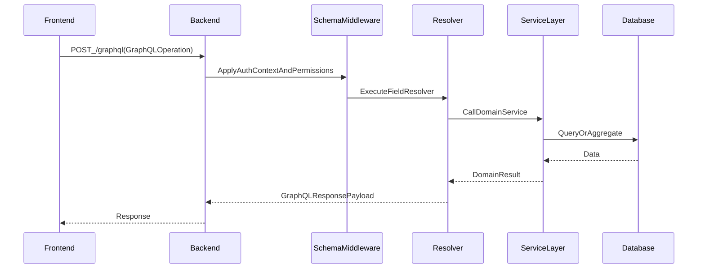

# Backend Architecture Documentation

## Overview

This document describes the **backend architecture** of the DOPAMS system (`/dopams-backend`). It is intended to help developers and stakeholders understand:

- How the backend is structured on disk (directory and module organization)
- How the GraphQL schema is assembled and how requests flow through the backend
- The major architectural layers (API layer, schema layer, service layer, data access layer)
- How authentication/authorization is enforced
- What “internal endpoints” exist (e.g., internal GraphQL used for schema/code generation)

This document is deliberately **no-code**: it avoids embedding code snippets. Instead, it uses **textual explanations**, **file-path references**, and **diagrams/illustrations**.

---

## Backend at a Glance

### High-level responsibilities

The backend provides:

1. A **GraphQL API** for all application data access (queries) and data changes (mutations)
2. **Authentication** (JWT-based) and request context construction
3. **Authorization** via permission middleware applied to the schema
4. **File upload handling** for FIR and Criminal Profile documents
5. **Database access** using Prisma and database views
6. Domain-oriented modules for FIRs, accused, seizures, criminal profiles, advanced search, users, home dashboard stats, etc.

### Diagram: request flow (external GraphQL)



---

## System Entry Points and Runtime Endpoints

### Primary server entrypoint

- Server bootstrap: `/dopams-backend/src/server.ts`

This file is the runtime entrypoint that:

- Instantiates Express
- Creates an Apollo Server configured with the GraphQL schema
- Applies middleware (CORS, JSON body parsing, file upload)
- Builds a per-request context (including current user and request ID)

### Exposed HTTP endpoints

The backend exposes at least these application-level endpoints:

1. **`/graphql`**  
   The primary GraphQL endpoint used by the frontend.

2. **`/graphql-internal`**  
   An internal GraphQL endpoint intended for schema tooling and code generation. This endpoint is useful for introspection and internal workflows.

3. **`/version`**  
   Simple HTTP endpoint returning application version metadata.

#### Illustration: endpoint purpose mapping

```text
External_clients (Frontend)
  └── /graphql  (primary GraphQL API)

Internal_tooling (Codegen, introspection, tooling)
  └── /graphql-internal

Ops/diagnostics
  └── /version
```

---

## Directory Structure (Backend)

Backend source root:

- `/dopams-backend/src`

### Top-level structure

```text
src/
  datasources/
  interfaces/
  schema/
  utils/
  permissions.ts
  server.ts
```

### Purpose of each top-level directory

#### `src/schema/` — Domain GraphQL modules

This is the heart of the API. It contains domain-oriented modules that each define:

- GraphQL types
- Inputs and filters
- Enums
- Query fields
- Mutation fields (for domains that support writes)
- Service layer functions used by resolvers

Domains include:

- `home/` (dashboard + high-level analytics)
- `firs/` (FIR listing, detail, statistics, seizures)
- `accused/` (accused listing, detail, statistics)
- `criminal-profile/` (profiles, case history, network support)
- `advanced-search/` (query-builder style searching)
- `user/` (auth + user management)
- `persons/` (person-centric queries, network entrypoints)
- `misc/` (shared types, ranges, enums, file-upload helpers)
- plus schema-level wiring (`schema/index.ts`, `schema/query.ts`, `schema/mutations.ts`)

#### `src/datasources/` — Data access clients

Contains shared “data clients” used by services/resolvers.

Examples:

- Prisma client wrapper: `src/datasources/prisma.ts`
- Additional data sources: `src/datasources/ndpsDatasource.ts` (domain-specific or external source integration)

#### `src/interfaces/` — TypeScript domain interfaces

Defines TypeScript interfaces for domain shapes used by services and filters. These interfaces serve as “developer-facing contracts” between layers.

Examples:

- `src/interfaces/fir.ts`
- `src/interfaces/accused.ts`
- `src/interfaces/advanced-search.ts`
- `src/interfaces/user.ts`

#### `src/utils/` — Shared utilities and error types

Contains:

- Error classes (authentication, invalid operations, not found, etc.)
- Logging utilities
- JWT helpers
- Misc utilities (date handling, file processing helpers)

Key subfolder:

- `src/utils/errors/` — standardized error types used across modules

---

## GraphQL Schema Composition (How the API is assembled)

### Schema entrypoint

- Schema construction: `/dopams-backend/src/schema/index.ts`

This file creates:

- A root `Query` type
- A root `Mutation` type
- A `GraphQLSchema` instance containing both

### Query field aggregation

- Query field aggregation file: `/dopams-backend/src/schema/query.ts`

This file composes the root query object by importing and merging query field groups from domain modules:

- `home/query`
- `user/query`
- `persons/query`
- `criminal-profile/query`
- `firs/query`
- `firs/query/seizures`
- `accused/query`
- `advanced-search/query`

#### Illustration: query field aggregation

```text
schema/query.ts
  ├── HomeQueryFields
  ├── UserQueryFields
  ├── PersonQueryFields
  ├── CriminalProfileQueryFields
  ├── FirQueryFields
  ├── SeizuresQueryFields
  ├── AccusedQueryFields
  └── AdvancedSearchQueryFields
        │
        ▼
root Query fields (one combined map)
```

### Mutation field aggregation

- Mutation field aggregation file: `/dopams-backend/src/schema/mutations.ts`

This file merges mutation field groups from:

- `user/mutations`
- `firs/mutations`
- `criminal-profile/mutations`

#### Illustration: mutation field aggregation

```text
schema/mutations.ts
  ├── UserMutationFields
  ├── FirMutationFields
  └── CriminalProfileMutationFields
        │
        ▼
root Mutation fields (one combined map)
```

---

## Domain Module Anatomy (Standard pattern)

Most domains inside `src/schema/<domain>/` follow a repeatable internal structure. Understanding this pattern helps developers quickly navigate the backend.

Typical domain layout:

```text
schema/<domain>/
  index.ts             (exports types, shared wiring)
  query/               (GraphQL query field definitions)
  mutations/           (GraphQL mutation field definitions, if needed)
  services/            (business logic and data access orchestration)
  filters/             (GraphQL input types used for filtering lists)
  input/               (GraphQL input types used for mutations or complex inputs)
  enums/ or enum/      (GraphQL enums for sorting, operators, etc.)
```

### What each subfolder means

#### `query/`

Contains GraphQL “field configurations” for queries:

- **Arguments** (GraphQL input shapes and requiredness)
- **Return types** (GraphQL object types)
- **Resolver function** references (usually delegating to services)

Conceptually:

```text
Query_field_definition
  ├── args (what callers can pass)
  ├── type (what callers receive)
  └── resolve (which service function provides the data)
```

#### `mutations/`

Contains GraphQL “field configurations” for mutations:

- Required inputs
- Output types (often a success payload or updated object)
- Service function calls that implement the operation

#### `services/`

Contains business logic and orchestration:

- Input validation (as needed)
- Data fetching via Prisma or datasource clients
- Transformation and aggregation
- Error handling (throwing standardized error classes)

Services are the main place where “real work” happens. Resolvers tend to stay thin and delegate here.

#### `filters/` and `input/`

Defines GraphQL input types that act like structured request parameters.

- **Filters** are used for list queries (pagination + filtering)
- **Inputs** are used for mutations or complex query inputs (like advanced search criteria)

#### `enums/` (or `enum/`)

Defines constrained sets of values, such as:

- Sort keys
- Sort directions (shared sort direction enum lives under `schema/misc`)
- Advanced-search operators (equals, contains, between, etc.)

---

## Permissions and Authorization Architecture

### Permission middleware location

- Permissions wiring: `/dopams-backend/src/permissions.ts`

### How permissions are applied

GraphQL authorization is applied as middleware over the schema (not scattered across each resolver). This yields:

- Consistent enforcement
- Centralized policy management
- Easier auditing

#### Illustration: middleware enforcement

```text
Client_Request
  ▼
ApolloServer
  ▼
GraphQLSchema
  ▼
Permission_Middleware (graphql-middleware / shield)
  ├── allow/deny decision
  └── error mapping (authentication/authorization)
  ▼
Resolver
  ▼
Service
  ▼
Database
```

### Authentication in request context

The request context is constructed in:

- `/dopams-backend/src/server.ts`

Key conceptual context fields:

- `sessionToken` (from request Authorization header)
- `currentUser` (resolved user object)
- `requestId` (used for logging/tracing)

This enables:

- Per-request permission decisions
- Audit logging correlation
- Consistent user identity access across resolvers/services

---

## Data Access Architecture

### Prisma client

- Prisma datasource wrapper: `/dopams-backend/src/datasources/prisma.ts`

The Prisma client is extended with pagination support and is shared across services.

#### Illustration: Prisma usage pattern

```text
Service_function
  ├── build filters
  ├── choose query strategy (ORM or raw SQL)
  ├── execute via Prisma client
  └── return normalized output
```

### Views and complex read models

The backend uses database views (see `/dopams-backend/prisma/views/`) for optimized read patterns and aggregated models. These views often back:

- advanced search results
- summary dashboards
- large “denormalized” datasets where joins are expensive at request time

---

## Internal vs External GraphQL

The server supports:

- **External GraphQL** (`/graphql`): subject to normal permission rules
- **Internal GraphQL** (`/graphql-internal`): intended for tooling and introspection

### Why this separation exists

It is common to keep an internal endpoint for:

- stable schema introspection even if production introspection is limited
- code generation pipelines
- internal diagnostics tooling

---

## Error Handling and Observability

### Error taxonomy

Standard error classes live under:

- `/dopams-backend/src/utils/errors/`

This yields:

- Consistent error messages
- Stable error codes for frontend handling (e.g., authentication vs validation)
- Easier logging and support diagnosis

### Logging

Logging utilities live under:

- `/dopams-backend/src/utils/logger.ts`

The backend also uses Apollo server plugin logging (`cirkleLogger`) to observe GraphQL operations, improving traceability.

---

## Backend File-Path Index (Where to look)

### Server and schema wiring

- Server entrypoint: `/dopams-backend/src/server.ts`
- Schema root: `/dopams-backend/src/schema/index.ts`
- Root queries: `/dopams-backend/src/schema/query.ts`
- Root mutations: `/dopams-backend/src/schema/mutations.ts`

### Major domains

- Home/dashboard: `/dopams-backend/src/schema/home/`
- FIRs: `/dopams-backend/src/schema/firs/`
- Seizures (query): `/dopams-backend/src/schema/firs/query/seizures.ts`
- Accused: `/dopams-backend/src/schema/accused/`
- Criminal profile: `/dopams-backend/src/schema/criminal-profile/`
- Advanced search: `/dopams-backend/src/schema/advanced-search/`
- Users/auth: `/dopams-backend/src/schema/user/`
- Persons: `/dopams-backend/src/schema/persons/`
- Misc shared types: `/dopams-backend/src/schema/misc/`

### Datasources and utilities

- Prisma client: `/dopams-backend/src/datasources/prisma.ts`
- JWT helper: `/dopams-backend/src/utils/jwt.ts`
- Errors: `/dopams-backend/src/utils/errors/`

---

## Document Status

- **Last updated**: February 2026
- **Version**: 1.0
- **Scope**: Backend code organization + request flow + internal endpoints (no-code)
