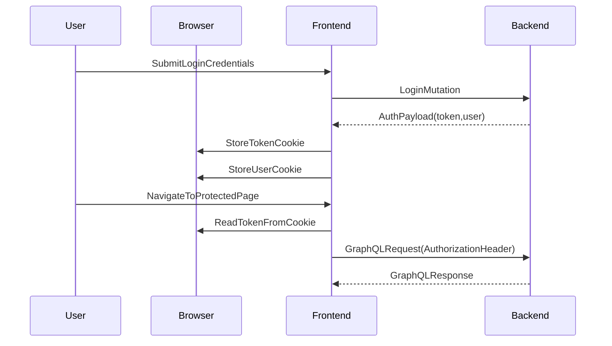
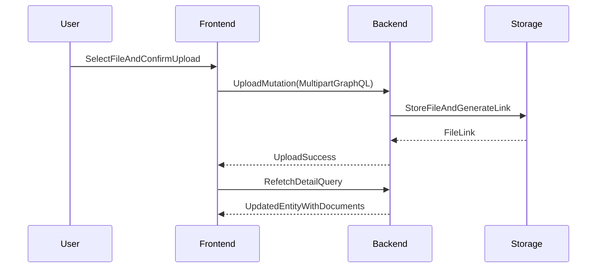

# Endpoint Integration Documentation (Frontend ↔ Backend)

## Overview

This document explains how the DOPAMS frontend (`dopams-narco`) integrates with the backend (`dopams-backend`). The goal is to describe the **internal application endpoints**, the **integration patterns**, and the **end-to-end flow** of requests and responses—using **text, diagrams, and illustrations**, and avoiding embedded code snippets.

Where other documents focus on _what_ APIs exist (`API_INVENTORY.md`) or _what_ the application features are (`APPLICATION_FUNCTIONALITY.md`), this document focuses on:

- How the frontend connects to backend endpoints
- How authentication is carried across requests
- How queries/mutations are executed and managed (loading/error/cache)
- How file uploads work end-to-end
- How internal endpoints like `/graphql-internal` fit in

---

## Integration Endpoints (Backend)

Backend endpoints relevant to integration (see `/dopams-backend/src/server.ts`):

1. **`/graphql`** (Primary GraphQL endpoint)
   - Used by the frontend for all business data operations (queries + mutations).

2. **`/graphql-internal`** (Internal GraphQL endpoint)
   - Intended for internal tooling (not day-to-day UI traffic).
   - Typically used for schema introspection and code generation pipelines.

3. **`/version`** (Diagnostics)
   - Used for operational checks and version reporting.

### Illustration: endpoint roles

```text
Frontend_UI  ───────────────►  /graphql
Tooling(Codegen) ───────────►  /graphql-internal
Ops/Monitoring ─────────────►  /version
```

---

## GraphQL Client Integration (Frontend)

### Integration entrypoint

Frontend integration wiring is centralized in:

- `/dopams-narco/src/main.tsx`

This file constructs a GraphQL client that is shared across the entire application through a provider pattern. Practically, this means:

- Pages do not “manually” create HTTP requests.
- Pages declare their data needs using GraphQL operations.
- The client manages transport, authentication headers, caching, and error interception.

### Transport and upload support

The frontend uses an upload-capable transport so that the same GraphQL endpoint can handle:

- Normal JSON GraphQL operations (queries/mutations)
- Multipart file uploads (for FIR and Criminal Profile documents)

This unifies the developer mental model: “Everything is GraphQL,” including file uploads.

#### Illustration: one endpoint, two transport modes

```text
GraphQL_operation_types
  ├── Query/Mutation (JSON)
  └── Upload_mutations (Multipart)

Both use:
  /graphql
```

---

## Authentication Integration (Session and Headers)

### Where authentication is stored (frontend)

Authentication data is stored in browser cookies:

- Token cookie name: `token`
- User cookie name: `user`

This behavior is implemented in:

- `/dopams-narco/src/utils/auth.ts`

### How the token is sent to the backend

The frontend attaches an `Authorization` header to requests. Conceptually:

1. Read token from cookies
2. Ensure it is in “Bearer token” format
3. Attach it to outgoing GraphQL requests

This attachment is performed globally (not per-page) in:

- `/dopams-narco/src/main.tsx`

### How the backend receives identity

The backend reads the `Authorization` header from the request and constructs a request context that includes:

- A `sessionToken` (raw header value)
- A `currentUser` object (resolved during request processing)

Context creation is in:

- `/dopams-backend/src/server.ts`

### Illustration: authentication data flow



---

## Request Lifecycle: Query Integration

This section describes how pages “consume” APIs without embedding code.

### Typical query lifecycle

1. A page/module renders.
2. The page declares a query operation and variables (e.g., page, limit, filters).
3. The GraphQL client evaluates whether cached data exists.
4. The client sends a request if needed.
5. The page renders one of:
   - loading UI (initial)
   - data UI (success)
   - error UI (failure)
6. Subsequent variable changes (filters/sort/pagination) repeat the cycle.

### Illustration: query lifecycle states

```text
Query_start
  ├── NoCacheHit -> NetworkRequest -> Response -> RenderData
  └── CacheHit   -> RenderCachedData -> OptionalBackgroundRefresh -> RenderUpdatedData

OnFailure:
  NetworkRequest -> Error -> RenderError -> UserRetry -> NetworkRequest
```

### Where this pattern appears

This pattern appears on nearly all “list pages”, such as:

- FIRs listing: `dopams-narco/src/routes/case-status/firs/index.tsx`
- Arrests listing: `dopams-narco/src/routes/case-status/arrests/index.tsx`
- Criminal profiles listing: `dopams-narco/src/routes/criminal-profile/index.tsx`

---

## Request Lifecycle: Mutation Integration

Mutations are typically executed in response to explicit user actions:

- login submission
- create user action
- update role/status actions
- file uploads

### Illustration: mutation lifecycle

```text
UserAction
  └── MutationRequest
        ├── Success -> UpdateUI -> OptionalRefetchOrCacheUpdate
        └── Error   -> ShowError -> UserRetry
```

---

## Error Handling Integration

### Global error interception

The frontend has a global error interception layer (GraphQL client error interception) that can detect authentication failures and network issues. This is centralized so that pages can remain focused on feature UI rather than repeating cross-cutting concerns.

### Types of errors commonly handled

1. **Authentication errors** (token expired/invalid)
2. **Authorization errors** (insufficient permissions)
3. **Network errors** (backend unavailable, CORS issues, timeouts)
4. **Validation errors** (bad inputs, rejected operations)

### Illustration: error propagation

```text
Backend_error
  ├── GraphQLError (structured)
  └── NetworkError (transport)

Frontend_handling
  ├── GlobalInterceptor (auth/session handling)
  └── PageLevelUI (display message, retry controls)
```

---

## Caching and Consistency (Apollo Cache)

### What caching achieves

Caching is essential in DOPAMS because many pages:

- paginate through large datasets
- revisit the same filtered views
- reuse the same entities across multiple pages (e.g., the same FIR referenced from multiple places)

### Pagination-aware caching

The frontend configures caching policies so that paginated queries merge correctly and avoid “losing” previously seen pages. This configuration lives in:

- `/dopams-narco/src/main.tsx`

### Illustration: paginated cache tracks

```text
Query:firs(filters=A,page=1) -> cacheTrack_A_page1
Query:firs(filters=A,page=2) -> cacheTrack_A_page2
Query:firs(filters=B,page=1) -> cacheTrack_B_page1

Key idea:
Different filter sets produce different cache tracks.
```

---

## File Upload Integration (End-to-end)

Two main upload pathways exist:

1. Upload files to FIR
2. Upload files to Criminal Profile

### End-to-end conceptual flow



### Why refetch is common after uploads

After a file upload, the frontend needs the updated document list. The simplest, most reliable approach is:

- Upload mutation succeeds
- Detail query refetches
- UI re-renders with updated document list

This provides consistent UX without complex cache rewriting.

---

## Internal Endpoints in the Development Workflow

### Schema-driven development

Because the application relies on generated GraphQL types in the frontend, a typical development workflow includes:

1. Backend schema changes (new fields/queries)
2. Schema introspection for tooling
3. Frontend type regeneration

In this workflow, `/graphql-internal` can be used to provide stable schema introspection for tools.

---

## Integration Surface Summary (Where to look)

Frontend:

- GraphQL client wiring: `/dopams-narco/src/main.tsx`
- Auth storage + token formatting: `/dopams-narco/src/utils/auth.ts`
- Modules consuming operations: `/dopams-narco/src/routes/`

Backend:

- Endpoint wiring + context: `/dopams-backend/src/server.ts`
- Schema composition: `/dopams-backend/src/schema/`

---

## Document Status

- **Last updated**: February 2026
- **Version**: 1.0
- **Scope**: Endpoint integration, authentication, caching, uploads (no-code)
