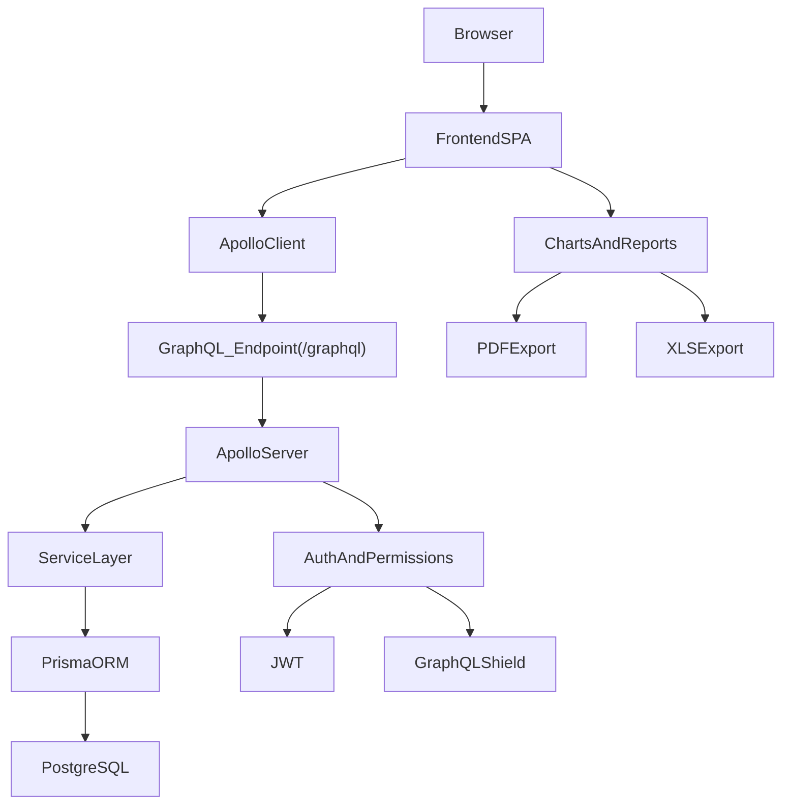

# Technology Stack Documentation

## Overview

This document provides a comprehensive, no-code overview of the **complete technology stack** used in the DOPAMS system:

- Frontend (`dopams-narco`)
- Backend (`dopams-backend`)
- Database and persistence layer
- Tooling (build, linting, formatting, code generation)
- Operational and runtime dependencies (auth, uploads, logging)

The intent is to help developers and stakeholders quickly understand what technologies are in use, why they exist in the system, and how they fit together. This is a descriptive reference—focused on **what** is used and **how the pieces relate**, rather than “how to install” or “how to code”.

---

## Table of Contents

1. [System Topology](#system-topology)
2. [Frontend Stack (dopams-narco)](#frontend-stack-dopams-narco)
3. [Backend Stack (dopams-backend)](#backend-stack-dopams-backend)
4. [Database Stack](#database-stack)
5. [API Protocol Stack](#api-protocol-stack)
6. [Security & Authentication Stack](#security--authentication-stack)
7. [File Upload & Document Handling Stack](#file-upload--document-handling-stack)
8. [Observability & Logging Stack](#observability--logging-stack)
9. [Developer Tooling Stack](#developer-tooling-stack)
10. [Dependency Relationships (Diagram)](#dependency-relationships-diagram)

---

## System Topology

DOPAMS is a client-server system composed of:

- A browser-based frontend SPA
- A Node.js backend exposing a GraphQL API
- A PostgreSQL database accessed via Prisma

### Illustration: system topology

```text
Browser
  └── Frontend_SPA (React)
        └── GraphQL_Client (Apollo)
              └── /graphql (HTTP)
                    └── Backend_API (Node + ApolloServer)
                          └── ORM (Prisma)
                                └── PostgreSQL
```

---

## Frontend Stack (dopams-narco)

Frontend dependency source:

- `/dopams-narco/package.json`

### Core runtime technologies

1. **React** (UI framework)
   - Provides component-based UI development and rendering.
   - Enables a SPA navigation model with a consistent “app-like” experience.

2. **TypeScript** (type system)
   - Provides static typing for reliability and maintainability.
   - Improves developer experience via better autocompletion and refactoring safety.

3. **React Router** (client-side routing)
   - Provides route-based navigation and dynamic route parameters.
   - Supports deep links to detail pages (FIR detail, accused profile, etc.).

4. **Apollo Client** (GraphQL client + server-state cache)
   - Standardizes data access across modules.
   - Manages caching, loading/error states, and request lifecycle.
   - Enables normalized cache and pagination policies for large datasets.

5. **Apollo Upload Client** (multipart GraphQL uploads)
   - Allows file uploads over GraphQL without switching to separate REST endpoints.

### UI and interaction libraries

1. **@admintoystack/toystack-ui** (component library)
   - Provides shared components and design system building blocks.

2. **Radix UI components** (accessible UI primitives)
   - Dialogs, popovers, tooltips, select menus, scroll areas.
   - Ensures predictable keyboard navigation and accessibility behaviors.

3. **Lucide React** (icons)
   - Consistent icon set for navigation and action icons.

4. **dnd-kit** (drag-and-drop)
   - Supports interactive column ordering / UI interactions (e.g., column management).

### Data visualization and reporting

1. **Recharts**
   - Charting library used for dashboards and statistics visualizations.

2. **D3**
   - Additional lower-level charting / transformation capabilities where needed.

3. **Excel/PDF tooling**
   - `exceljs`, `xlsx`, `file-saver`: used for Excel generation and download flows.
   - `jspdf`, `jspdf-autotable`, `pdfmake`: used to generate PDF exports.

### Styling and UI composition

1. **Tailwind CSS**
   - Utility-first styling and consistent composition.

2. **tailwind-merge** and **tailwindcss-animate**
   - Utility merging and animation helpers for consistent UI behaviors.

### Frontend build tooling

1. **Vite**
   - Fast dev server and build pipeline.
   - Bundling and HMR.

2. **Vite plugin checker**
   - Integrates TypeScript checking and ESLint linting during development.

3. **Alias configuration**
   - `@` path alias to simplify imports (see `/dopams-narco/vite.config.ts`).

---

## Backend Stack (dopams-backend)

Backend dependency source:

- `/dopams-backend/package.json`

### Core runtime technologies

1. **Node.js**
   - Runtime environment for server execution.

2. **Express**
   - HTTP server framework used as the host for GraphQL endpoints and supporting routes.

3. **Apollo Server**
   - GraphQL server implementation.
   - Handles parsing, validation, execution, and response formatting for GraphQL operations.

4. **GraphQL**
   - Schema-first API protocol with type system and introspection.

### GraphQL security and governance

1. **graphql-depth-limit**
   - Protects the backend from overly deep nested queries that may be expensive.

2. **graphql-middleware**
   - Enables schema-level middleware (used for permissions and cross-cutting behaviors).

3. **graphql-shield**
   - Declarative permission layer that can enforce authorization rules.

### Data access and persistence

1. **Prisma** and **@prisma/client**
   - ORM used for database access.
   - Supports schema modeling, migrations, and type-safe DB queries.

2. **pg**
   - PostgreSQL driver used by Prisma and/or direct DB access patterns.

3. **prisma-extension-pagination**
   - Adds convenient pagination support patterns to Prisma.

### Authentication and identity

1. **jsonwebtoken**
   - JWT creation and verification.

2. **bcrypt / bcryptjs**
   - Password hashing and verification for user authentication.

### File uploads and documents

1. **graphql-upload-ts**
   - Upload scalar and server middleware enabling multipart file upload over GraphQL.

### Utility and platform dependencies

1. **cors** and **body-parser**
   - Cross-origin request handling and request body parsing.

2. **dotenv**
   - Environment variable loading.

3. **winston**
   - Logging framework (structured logging and transports).

4. **uuid / short-unique-id**
   - Identifier creation (request IDs, reference IDs, etc.).

5. **axios / node-fetch**
   - HTTP clients for any external integrations or data sources.

6. **nodemailer** and **@sendgrid/mail**
   - Email integrations (account workflows like invites or password resets).

---

## Database Stack

Primary database:

- **PostgreSQL**

ORM and modeling:

- **Prisma**
  - Schema defined in `/dopams-backend/prisma/schema.prisma`
  - Uses advanced features: extensions and views

### Notable database capabilities used

1. **Views**
   - Used to build efficient read models for analytics and complex searches.

2. **Indexes**
   - Indexed fields for performance (case status, crime type, police station codes, etc.).

3. **Extensions**
   - Includes PostgreSQL extensions such as UUID support and vector support (as configured in Prisma datasource).

---

## API Protocol Stack

1. **GraphQL over HTTP**
   - Single endpoint API surface with typed schema.
   - Queries for reads, mutations for writes.

2. **Multipart GraphQL (Uploads)**
   - File uploads handled via GraphQL upload protocol.

3. **Introspection**
   - Enabled differently for production vs internal endpoint usage.

---

## Security & Authentication Stack

1. **JWT-based authentication**
   - Frontend stores token in cookies.
   - Frontend attaches `Authorization` header to GraphQL requests.
   - Backend constructs request context with user identity.

2. **Role-based permissions**
   - Enforced via schema middleware and shield-style permission definitions.

3. **Password hashing**
   - bcrypt/bcryptjs used for secure password storage/verification.

---

## File Upload & Document Handling Stack

1. **Frontend**
   - Upload-capable GraphQL client transport
   - UI dialogs and document lists

2. **Backend**
   - Upload middleware (`graphql-upload-ts`)
   - Upload mutations (FIR and Criminal Profile)
   - Document link creation and persistence

---

## Observability & Logging Stack

1. **Winston**
   - Structured logging and log levels.

2. **Apollo Server plugins**
   - GraphQL operation logging and tracing.

3. **Request correlation**
   - Request IDs used to trace operations across logs.

---

## Developer Tooling Stack

### Frontend tooling

- ESLint (static analysis)
- Prettier (formatting)
- GraphQL Code Generator (schema-driven type generation)
- TypeScript compiler (`tsc`)
- Vite dev server and build tool

### Backend tooling

- TypeScript compiler
- ts-node-dev (development hot reload)
- nodemon (some scripts)
- Husky + lint-staged (pre-commit hygiene)
- module-alias tooling for import ergonomics

---

## Dependency Relationships Diagram



---

## Document Status

- **Last updated**: February 2026
- **Version**: 1.0
- **Scope**: Full DOPAMS tech stack (no-code)
